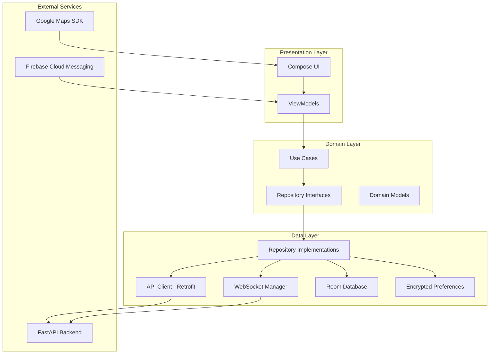

# Design Document: Android Ride-Hailing Application

## Overview

This design document specifies the architecture and implementation details for two native Android applications: the Rider App and Driver App for the RideConnect ride-hailing platform. Both applications are built using modern Android development practices with Kotlin, Jetpack Compose, and MVVM architecture.

### Key Design Principles

- **Separation of Concerns**: Clear separation between UI, business logic, and data layers
- **Reactive Programming**: StateFlow and Compose for reactive UI updates
- **Offline-First**: Local database with background synchronization
- **Real-Time Communication**: WebSocket integration for live updates
- **Testability**: Dependency injection and interface-based design for easy testing
- **Performance**: Efficient resource usage with coroutines and background processing
- **Security**: Encrypted storage and secure network communication

### Technology Stack

- **Language**: Kotlin
- **UI Framework**: Jetpack Compose with Material Design 3
- **Architecture**: MVVM (Model-View-ViewModel)
- **Networking**: Retrofit 2.9+ with OkHttp 4.x
- **WebSocket**: OkHttp WebSocket
- **Dependency Injection**: Hilt (Dagger)
- **Database**: Room 2.5+
- **Maps**: Google Maps SDK for Android
- **Image Loading**: Coil
- **Async Operations**: Kotlin Coroutines with Flow
- **Push Notifications**: Firebase Cloud Messaging
- **Authentication**: JWT with EncryptedSharedPreferences
- **Testing**: JUnit 5, Espresso, MockK

## Architecture

### High-Level Architecture

The application follows Clean Architecture principles with three main layers:

1. **Presentation Layer** (UI + ViewModel)
   - Jetpack Compose UI components
   - ViewModels managing UI state
   - Navigation handling

2. **Domain Layer** (Business Logic)
   - Use cases encapsulating business rules
   - Domain models
   - Repository interfaces

3. **Data Layer** (Data Sources)
   - Repository implementations
   - Remote data sources (API clients)
   - Local data sources (Room database)
   - WebSocket manager

### Architecture Diagram



### Module Structure

Both apps share common modules with app-specific implementations:

```
android-ride-hailing/
├── rider-app/                 # Rider application module
│   ├── src/main/
│   │   ├── kotlin/com/rideconnect/rider/
│   │   │   ├── ui/           # Rider-specific UI screens
│   │   │   ├── viewmodel/    # Rider ViewModels
│   │   │   └── RiderApp.kt   # Application class
│   │   └── res/              # Rider resources
│   └── build.gradle.kts
│
├── driver-app/                # Driver application module
│   ├── src/main/
│   │   ├── kotlin/com/rideconnect/driver/
│   │   │   ├── ui/           # Driver-specific UI screens
│   │   │   ├── viewmodel/    # Driver ViewModels
│   │   │   └── DriverApp.kt  # Application class
│   │   └── res/              # Driver resources
│   └── build.gradle.kts
│
├── core/                      # Shared core module
│   ├── domain/               # Domain layer (use cases, models)
│   ├── data/                 # Data layer (repositories, data sources)
│   ├── network/              # Network clients (Retrofit, WebSocket)
│   ├── database/             # Room database
│   ├── common/               # Common utilities
│   └── build.gradle.kts
│
└── build.gradle.kts          # Root build file
```

## Components and Interfaces

### 1. Authentication Module

#### Components

**AuthRepository**
```kotlin
interface AuthRepository {
    suspend fun sendOtp(phoneNumber: String): Result<Unit>
    suspend fun verifyOtp(phoneNumber: String, otp: String): Result<AuthToken>
    suspend fun refreshToken(refreshToken: String): Result<AuthToken>
    suspend fun logout(): Result<Unit>
    fun getStoredToken(): AuthToken?
    suspend fun saveToken(token: AuthToken)
    suspend fun clearToken()
}
```

**BiometricAuthManager**
```kotlin
interface BiometricAuthManager {
    fun isBiometricAvailable(): Boolean
    suspend fun authenticateWithBiometric(): Result<Boolean>
    suspend fun enableBiometric(token: AuthToken)
    suspend fun disableBiometric()
    fun isBiometricEnabled(): Boolean
}
```

**AuthViewModel**
```kotlin
class AuthViewModel(
    private val authRepository: AuthRepository,
    private val biometricAuthManager: BiometricAuthManager
) : ViewModel() {
    val authState: StateFlow<AuthState>
    fun sendOtp(phoneNumber: String)
    fun verifyOtp(otp: String)
    fun loginWithBiometric()
    fun logout()
}
```

#### Data Flow

1. User enters phone number → ViewModel validates format → Repository calls API
2. Backend sends OTP via SMS → User enters OTP → Repository verifies with API
3. Backend returns JWT token → Repository stores in EncryptedSharedPreferences
4. Token included in all subsequent API requests via OkHttp interceptor

### 2. Location Module

#### Components

**LocationService**
```kotlin
interface LocationService {
    fun startLocationUpdates(intervalMs: Long)
    fun stopLocationUpdates()
    val locationFlow: Flow<Location>
    suspend fun getCurrentLocation(): Location?
}
```

**LocationRepository**
```kotlin
interface LocationRepository {
    suspend fun updateLocation(location: Location): Result<Unit>
    suspend fun searchPlaces(query: String): Result<List<Place>>
    suspend fun getPlaceDetails(placeId: String): Result<Place>
    suspend fun calculateRoute(origin: Location, destination: Location): Result<Route>
}
```

**LocationViewModel**
```kotlin
class LocationViewModel(
    private val locationService: LocationService,
    private val locationRepository: LocationRepository
) : ViewModel() {
    val currentLocation: StateFlow<Location?>
    val searchResults: StateFlow<List<Place>>
    fun searchPlaces(query: String)
    fun selectPlace(place: Place)
}
```

#### Implementation Details

- Uses FusedLocationProviderClient for optimal accuracy and battery efficiency
- Location updates sent to backend every 10 seconds when driver is online
- Foreground service for background location tracking (Driver App)
- Google Places API integration for location search and autocomplete


### 3. Ride Management Module (Rider App)

#### Components

**RideRepository**
```kotlin
interface RideRepository {
    suspend fun requestRide(request: RideRequest): Result<Ride>
    suspend fun scheduleRide(request: ScheduledRideRequest): Result<ScheduledRide>
    suspend fun cancelRide(rideId: String, reason: String): Result<Unit>
    suspend fun getRideDetails(rideId: String): Result<Ride>
    suspend fun getRideHistory(page: Int, pageSize: Int): Result<List<Ride>>
    fun observeActiveRide(): Flow<Ride?>
}
```

**RideViewModel**
```kotlin
class RideViewModel(
    private val rideRepository: RideRepository,
    private val locationRepository: LocationRepository,
    private val webSocketManager: WebSocketManager
) : ViewModel() {
    val activeRide: StateFlow<Ride?>
    val rideHistory: StateFlow<List<Ride>>
    val fareEstimate: StateFlow<FareEstimate?>
    
    fun requestRide(pickup: Location, dropoff: Location)
    fun scheduleRide(pickup: Location, dropoff: Location, scheduledTime: LocalDateTime)
    fun cancelRide(reason: String)
    fun calculateFare(pickup: Location, dropoff: Location)
}
```

#### State Management

Ride states follow this lifecycle:
1. **REQUESTED** - Ride request sent to backend
2. **SEARCHING** - Backend searching for available drivers
3. **ACCEPTED** - Driver accepted the ride
4. **DRIVER_ARRIVING** - Driver en route to pickup
5. **ARRIVED** - Driver at pickup location
6. **IN_PROGRESS** - Ride started, en route to destination
7. **COMPLETED** - Ride finished successfully
8. **CANCELLED** - Ride cancelled by rider or driver

### 4. Ride Management Module (Driver App)

#### Components

**DriverRideRepository**
```kotlin
interface DriverRideRepository {
    suspend fun setAvailability(isAvailable: Boolean): Result<Unit>
    suspend fun acceptRide(rideId: String): Result<Ride>
    suspend fun rejectRide(rideId: String, reason: String): Result<Unit>
    suspend fun startRide(rideId: String): Result<Unit>
    suspend fun completeRide(rideId: String): Result<Unit>
    suspend fun cancelRide(rideId: String, reason: String): Result<Unit>
    fun observeRideRequests(): Flow<RideRequest>
    fun observeActiveRide(): Flow<Ride?>
}
```

**DriverViewModel**
```kotlin
class DriverViewModel(
    private val driverRideRepository: DriverRideRepository,
    private val locationService: LocationService,
    private val webSocketManager: WebSocketManager
) : ViewModel() {
    val isOnline: StateFlow<Boolean>
    val activeRide: StateFlow<Ride?>
    val incomingRequest: StateFlow<RideRequest?>
    val earnings: StateFlow<EarningsData>
    
    fun toggleAvailability()
    fun acceptRide(rideId: String)
    fun rejectRide(rideId: String, reason: String)
    fun startRide()
    fun completeRide()
}
```

#### Driver Availability Logic

- When driver goes online: Start LocationService, connect WebSocket, update backend
- When driver goes offline: Stop LocationService, disconnect WebSocket, update backend
- Location updates sent every 10 seconds while online
- Ride requests received via WebSocket with 30-second timeout

### 5. WebSocket Module

#### Components

**WebSocketManager**
```kotlin
interface WebSocketManager {
    fun connect(token: String)
    fun disconnect()
    fun send(message: WebSocketMessage)
    val connectionState: StateFlow<ConnectionState>
    val messages: Flow<WebSocketMessage>
}
```

**WebSocketMessage Types**
```kotlin
sealed class WebSocketMessage {
    data class LocationUpdate(val location: Location, val timestamp: Long) : WebSocketMessage()
    data class RideStatusUpdate(val rideId: String, val status: RideStatus) : WebSocketMessage()
    data class RideRequest(val ride: Ride) : WebSocketMessage()
    data class RideAccepted(val rideId: String, val driver: Driver) : WebSocketMessage()
    data class ChatMessage(val rideId: String, val message: String, val senderId: String) : WebSocketMessage()
}
```

#### Implementation Details

- Uses OkHttp WebSocket for connection management
- Automatic reconnection with exponential backoff (1s, 2s, 4s, 8s, max 30s)
- Heartbeat/ping every 30 seconds to keep connection alive
- Message queue for offline messages, sent when connection restored
- Authentication via JWT token in connection URL or initial message


### 6. Payment Module

#### Components

**PaymentRepository**
```kotlin
interface PaymentRepository {
    suspend fun processPayment(rideId: String, amount: Double): Result<Transaction>
    suspend fun getPaymentHistory(page: Int, pageSize: Int): Result<List<Transaction>>
    suspend fun getReceipt(transactionId: String): Result<Receipt>
}
```

**PaymentViewModel**
```kotlin
class PaymentViewModel(
    private val paymentRepository: PaymentRepository
) : ViewModel() {
    val paymentStatus: StateFlow<PaymentStatus>
    val paymentHistory: StateFlow<List<Transaction>>
    
    fun processPayment(rideId: String, amount: Double)
    fun getReceipt(transactionId: String)
}
```

#### Payment Flow

1. Ride completed → Backend calculates final fare
2. Rider confirms payment → App calls payment API endpoint
3. Backend initiates payment with Razorpay/Paytm
4. Payment gateway processes transaction
5. Backend receives webhook → Updates transaction status
6. App receives payment confirmation via API response or WebSocket
7. Receipt generated and stored locally

### 7. Rating and Review Module

#### Components

**RatingRepository**
```kotlin
interface RatingRepository {
    suspend fun submitRating(rideId: String, rating: Int, review: String?): Result<Unit>
    suspend fun getRatings(userId: String): Result<List<Rating>>
    suspend fun getAverageRating(userId: String): Result<Double>
}
```

**RatingViewModel**
```kotlin
class RatingViewModel(
    private val ratingRepository: RatingRepository
) : ViewModel() {
    val averageRating: StateFlow<Double>
    val ratings: StateFlow<List<Rating>>
    
    fun submitRating(rideId: String, rating: Int, review: String?)
    fun loadRatings()
}
```

### 8. Parcel Delivery Module

#### Components

**ParcelRepository**
```kotlin
interface ParcelRepository {
    suspend fun requestParcelDelivery(request: ParcelDeliveryRequest): Result<ParcelDelivery>
    suspend fun confirmPickup(deliveryId: String): Result<Unit>
    suspend fun confirmDelivery(deliveryId: String): Result<Unit>
    suspend fun getParcelHistory(page: Int, pageSize: Int): Result<List<ParcelDelivery>>
    fun observeActiveParcel(): Flow<ParcelDelivery?>
}
```

**ParcelDeliveryRequest**
```kotlin
data class ParcelDeliveryRequest(
    val pickupLocation: Location,
    val dropoffLocation: Location,
    val parcelSize: ParcelSize,
    val senderName: String,
    val senderPhone: String,
    val recipientName: String,
    val recipientPhone: String,
    val instructions: String?
)

enum class ParcelSize {
    SMALL,   // Up to 5kg
    MEDIUM,  // 5-15kg
    LARGE    // 15-30kg
}
```

### 9. Chat Module

#### Components

**ChatRepository**
```kotlin
interface ChatRepository {
    suspend fun sendMessage(rideId: String, message: String): Result<ChatMessage>
    fun observeMessages(rideId: String): Flow<List<ChatMessage>>
    suspend fun markAsRead(rideId: String, messageId: String): Result<Unit>
}
```

**ChatViewModel**
```kotlin
class ChatViewModel(
    private val chatRepository: ChatRepository,
    private val webSocketManager: WebSocketManager
) : ViewModel() {
    val messages: StateFlow<List<ChatMessage>>
    val unreadCount: StateFlow<Int>
    
    fun sendMessage(message: String)
    fun markAsRead(messageId: String)
}
```

#### Implementation Details

- Messages sent via WebSocket for real-time delivery
- Fallback to REST API if WebSocket unavailable
- Messages stored in Room database for offline access
- Push notification for new messages when app in background
- Message delivery status: SENT, DELIVERED, READ


### 10. Emergency Module

#### Components

**EmergencyRepository**
```kotlin
interface EmergencyRepository {
    suspend fun triggerSOS(rideId: String, location: Location): Result<Unit>
    suspend fun addEmergencyContact(contact: EmergencyContact): Result<Unit>
    suspend fun removeEmergencyContact(contactId: String): Result<Unit>
    suspend fun getEmergencyContacts(): Result<List<EmergencyContact>>
    suspend fun shareRideWithContacts(rideId: String, contactIds: List<String>): Result<Unit>
}
```

**EmergencyViewModel**
```kotlin
class EmergencyViewModel(
    private val emergencyRepository: EmergencyRepository,
    private val locationService: LocationService
) : ViewModel() {
    val emergencyContacts: StateFlow<List<EmergencyContact>>
    val sosActive: StateFlow<Boolean>
    
    fun triggerSOS()
    fun addEmergencyContact(contact: EmergencyContact)
    fun shareRide(rideId: String)
}
```

#### SOS Flow

1. User taps SOS button → Confirm dialog shown
2. User confirms → App gets current location
3. App sends SOS alert to backend with location
4. Backend notifies authorities and emergency contacts via SMS
5. App displays emergency contact numbers for direct calling
6. Location tracking continues with higher frequency (every 5 seconds)

### 11. Push Notification Module

#### Components

**NotificationManager**
```kotlin
interface NotificationManager {
    suspend fun registerDeviceToken(token: String): Result<Unit>
    fun handleNotification(notification: RemoteMessage)
    fun showLocalNotification(title: String, message: String, data: Map<String, String>)
    suspend fun updateNotificationPreferences(preferences: NotificationPreferences): Result<Unit>
}
```

**Notification Types**
```kotlin
enum class NotificationType {
    RIDE_ACCEPTED,
    DRIVER_ARRIVING,
    DRIVER_ARRIVED,
    RIDE_STARTED,
    RIDE_COMPLETED,
    RIDE_CANCELLED,
    NEW_RIDE_REQUEST,
    CHAT_MESSAGE,
    PAYMENT_SUCCESS,
    PAYMENT_FAILED,
    SCHEDULED_RIDE_REMINDER
}
```

#### Implementation Details

- Firebase Cloud Messaging for push notifications
- Device token registered with backend on app launch
- Notification channels for different types (Android 8.0+)
- Deep linking to relevant screens when notification tapped
- User preferences for enabling/disabling specific notification types

## Data Models

### Core Domain Models

**User**
```kotlin
data class User(
    val id: String,
    val phoneNumber: String,
    val name: String,
    val email: String?,
    val profilePhotoUrl: String?,
    val userType: UserType,
    val rating: Double,
    val createdAt: LocalDateTime
)

enum class UserType {
    RIDER,
    DRIVER
}
```

**Driver (extends User)**
```kotlin
data class Driver(
    val user: User,
    val vehicleDetails: VehicleDetails,
    val licenseNumber: String,
    val isAvailable: Boolean,
    val currentLocation: Location?,
    val acceptsParcelDelivery: Boolean,
    val acceptsExtendedArea: Boolean
)

data class VehicleDetails(
    val make: String,
    val model: String,
    val year: Int,
    val color: String,
    val licensePlate: String,
    val vehicleType: VehicleType
)

enum class VehicleType {
    SEDAN,
    SUV,
    HATCHBACK,
    AUTO
}
```

**Ride**
```kotlin
data class Ride(
    val id: String,
    val riderId: String,
    val driverId: String?,
    val pickupLocation: Location,
    val dropoffLocation: Location,
    val status: RideStatus,
    val fare: Double?,
    val distance: Double?,
    val duration: Int?,
    val requestedAt: LocalDateTime,
    val acceptedAt: LocalDateTime?,
    val startedAt: LocalDateTime?,
    val completedAt: LocalDateTime?,
    val cancelledAt: LocalDateTime?,
    val cancellationReason: String?
)

enum class RideStatus {
    REQUESTED,
    SEARCHING,
    ACCEPTED,
    DRIVER_ARRIVING,
    ARRIVED,
    IN_PROGRESS,
    COMPLETED,
    CANCELLED
}
```

**Location**
```kotlin
data class Location(
    val latitude: Double,
    val longitude: Double,
    val address: String?,
    val placeId: String?
)
```

**ScheduledRide**
```kotlin
data class ScheduledRide(
    val id: String,
    val riderId: String,
    val pickupLocation: Location,
    val dropoffLocation: Location,
    val scheduledTime: LocalDateTime,
    val status: ScheduledRideStatus,
    val createdAt: LocalDateTime
)

enum class ScheduledRideStatus {
    SCHEDULED,
    CONFIRMED,
    IN_PROGRESS,
    COMPLETED,
    CANCELLED
}
```

**ParcelDelivery**
```kotlin
data class ParcelDelivery(
    val id: String,
    val senderId: String,
    val driverId: String?,
    val pickupLocation: Location,
    val dropoffLocation: Location,
    val parcelSize: ParcelSize,
    val senderName: String,
    val senderPhone: String,
    val recipientName: String,
    val recipientPhone: String,
    val instructions: String?,
    val status: ParcelStatus,
    val fare: Double?,
    val requestedAt: LocalDateTime,
    val pickedUpAt: LocalDateTime?,
    val deliveredAt: LocalDateTime?
)

enum class ParcelStatus {
    REQUESTED,
    ACCEPTED,
    PICKED_UP,
    IN_TRANSIT,
    DELIVERED,
    CANCELLED
}
```


**Transaction**
```kotlin
data class Transaction(
    val id: String,
    val rideId: String,
    val amount: Double,
    val paymentMethod: PaymentMethod,
    val status: TransactionStatus,
    val transactionId: String?,
    val createdAt: LocalDateTime,
    val completedAt: LocalDateTime?
)

enum class PaymentMethod {
    RAZORPAY,
    PAYTM,
    CASH
}

enum class TransactionStatus {
    PENDING,
    PROCESSING,
    COMPLETED,
    FAILED,
    REFUNDED
}
```

**Rating**
```kotlin
data class Rating(
    val id: String,
    val rideId: String,
    val raterId: String,
    val ratedUserId: String,
    val rating: Int,
    val review: String?,
    val createdAt: LocalDateTime
)
```

**ChatMessage**
```kotlin
data class ChatMessage(
    val id: String,
    val rideId: String,
    val senderId: String,
    val message: String,
    val timestamp: LocalDateTime,
    val status: MessageStatus
)

enum class MessageStatus {
    SENT,
    DELIVERED,
    READ
}
```

**EmergencyContact**
```kotlin
data class EmergencyContact(
    val id: String,
    val name: String,
    val phoneNumber: String,
    val relationship: String?
)
```

### Database Schema (Room)

**Entity Definitions**

```kotlin
@Entity(tableName = "users")
data class UserEntity(
    @PrimaryKey val id: String,
    val phoneNumber: String,
    val name: String,
    val email: String?,
    val profilePhotoUrl: String?,
    val userType: String,
    val rating: Double,
    val createdAt: Long
)

@Entity(tableName = "rides")
data class RideEntity(
    @PrimaryKey val id: String,
    val riderId: String,
    val driverId: String?,
    val pickupLatitude: Double,
    val pickupLongitude: Double,
    val pickupAddress: String?,
    val dropoffLatitude: Double,
    val dropoffLongitude: Double,
    val dropoffAddress: String?,
    val status: String,
    val fare: Double?,
    val distance: Double?,
    val duration: Int?,
    val requestedAt: Long,
    val acceptedAt: Long?,
    val startedAt: Long?,
    val completedAt: Long?,
    val cancelledAt: Long?,
    val cancellationReason: String?
)

@Entity(tableName = "scheduled_rides")
data class ScheduledRideEntity(
    @PrimaryKey val id: String,
    val riderId: String,
    val pickupLatitude: Double,
    val pickupLongitude: Double,
    val pickupAddress: String?,
    val dropoffLatitude: Double,
    val dropoffLongitude: Double,
    val dropoffAddress: String?,
    val scheduledTime: Long,
    val status: String,
    val createdAt: Long
)

@Entity(tableName = "transactions")
data class TransactionEntity(
    @PrimaryKey val id: String,
    val rideId: String,
    val amount: Double,
    val paymentMethod: String,
    val status: String,
    val transactionId: String?,
    val createdAt: Long,
    val completedAt: Long?
)

@Entity(tableName = "chat_messages")
data class ChatMessageEntity(
    @PrimaryKey val id: String,
    val rideId: String,
    val senderId: String,
    val message: String,
    val timestamp: Long,
    val status: String
)

@Entity(tableName = "emergency_contacts")
data class EmergencyContactEntity(
    @PrimaryKey val id: String,
    val userId: String,
    val name: String,
    val phoneNumber: String,
    val relationship: String?
)
```

**DAO Interfaces**

```kotlin
@Dao
interface RideDao {
    @Query("SELECT * FROM rides WHERE riderId = :userId ORDER BY requestedAt DESC")
    fun getRideHistory(userId: String): Flow<List<RideEntity>>
    
    @Query("SELECT * FROM rides WHERE id = :rideId")
    suspend fun getRideById(rideId: String): RideEntity?
    
    @Insert(onConflict = OnConflictStrategy.REPLACE)
    suspend fun insertRide(ride: RideEntity)
    
    @Update
    suspend fun updateRide(ride: RideEntity)
    
    @Query("DELETE FROM rides WHERE id = :rideId")
    suspend fun deleteRide(rideId: String)
}

@Dao
interface TransactionDao {
    @Query("SELECT * FROM transactions WHERE rideId IN (SELECT id FROM rides WHERE riderId = :userId) ORDER BY createdAt DESC")
    fun getTransactionHistory(userId: String): Flow<List<TransactionEntity>>
    
    @Insert(onConflict = OnConflictStrategy.REPLACE)
    suspend fun insertTransaction(transaction: TransactionEntity)
}

@Dao
interface ChatMessageDao {
    @Query("SELECT * FROM chat_messages WHERE rideId = :rideId ORDER BY timestamp ASC")
    fun getMessages(rideId: String): Flow<List<ChatMessageEntity>>
    
    @Insert(onConflict = OnConflictStrategy.REPLACE)
    suspend fun insertMessage(message: ChatMessageEntity)
    
    @Query("UPDATE chat_messages SET status = :status WHERE id = :messageId")
    suspend fun updateMessageStatus(messageId: String, status: String)
}

@Dao
interface EmergencyContactDao {
    @Query("SELECT * FROM emergency_contacts WHERE userId = :userId")
    fun getEmergencyContacts(userId: String): Flow<List<EmergencyContactEntity>>
    
    @Insert(onConflict = OnConflictStrategy.REPLACE)
    suspend fun insertContact(contact: EmergencyContactEntity)
    
    @Delete
    suspend fun deleteContact(contact: EmergencyContactEntity)
}
```


### API Client Design

**Retrofit Service Interfaces**

```kotlin
interface AuthApi {
    @POST("/api/auth/send-otp")
    suspend fun sendOtp(@Body request: SendOtpRequest): Response<Unit>
    
    @POST("/api/auth/verify-otp")
    suspend fun verifyOtp(@Body request: VerifyOtpRequest): Response<AuthResponse>
    
    @POST("/api/auth/refresh")
    suspend fun refreshToken(@Body request: RefreshTokenRequest): Response<AuthResponse>
    
    @POST("/api/auth/logout")
    suspend fun logout(): Response<Unit>
}

interface RideApi {
    @POST("/api/rides/request")
    suspend fun requestRide(@Body request: RideRequest): Response<RideResponse>
    
    @POST("/api/rides/schedule")
    suspend fun scheduleRide(@Body request: ScheduledRideRequest): Response<ScheduledRideResponse>
    
    @GET("/api/rides/{rideId}")
    suspend fun getRideDetails(@Path("rideId") rideId: String): Response<RideResponse>
    
    @GET("/api/rides/history")
    suspend fun getRideHistory(
        @Query("page") page: Int,
        @Query("page_size") pageSize: Int
    ): Response<List<RideResponse>>
    
    @POST("/api/rides/{rideId}/cancel")
    suspend fun cancelRide(
        @Path("rideId") rideId: String,
        @Body request: CancelRideRequest
    ): Response<Unit>
    
    @POST("/api/rides/{rideId}/accept")
    suspend fun acceptRide(@Path("rideId") rideId: String): Response<RideResponse>
    
    @POST("/api/rides/{rideId}/reject")
    suspend fun rejectRide(
        @Path("rideId") rideId: String,
        @Body request: RejectRideRequest
    ): Response<Unit>
    
    @POST("/api/rides/{rideId}/start")
    suspend fun startRide(@Path("rideId") rideId: String): Response<Unit>
    
    @POST("/api/rides/{rideId}/complete")
    suspend fun completeRide(@Path("rideId") rideId: String): Response<Unit>
}

interface DriverApi {
    @POST("/api/drivers/availability")
    suspend fun setAvailability(@Body request: AvailabilityRequest): Response<Unit>
    
    @GET("/api/drivers/earnings")
    suspend fun getEarnings(
        @Query("start_date") startDate: String,
        @Query("end_date") endDate: String
    ): Response<EarningsResponse>
}

interface LocationApi {
    @POST("/api/location/update")
    suspend fun updateLocation(@Body request: LocationUpdateRequest): Response<Unit>
    
    @GET("/api/location/search")
    suspend fun searchPlaces(@Query("query") query: String): Response<List<PlaceResponse>>
    
    @GET("/api/location/route")
    suspend fun calculateRoute(
        @Query("origin_lat") originLat: Double,
        @Query("origin_lng") originLng: Double,
        @Query("dest_lat") destLat: Double,
        @Query("dest_lng") destLng: Double
    ): Response<RouteResponse>
}

interface PaymentApi {
    @POST("/api/payments/process")
    suspend fun processPayment(@Body request: PaymentRequest): Response<TransactionResponse>
    
    @GET("/api/payments/history")
    suspend fun getPaymentHistory(
        @Query("page") page: Int,
        @Query("page_size") pageSize: Int
    ): Response<List<TransactionResponse>>
}

interface RatingApi {
    @POST("/api/ratings")
    suspend fun submitRating(@Body request: RatingRequest): Response<Unit>
    
    @GET("/api/ratings/{userId}")
    suspend fun getRatings(@Path("userId") userId: String): Response<List<RatingResponse>>
}

interface ParcelApi {
    @POST("/api/parcels/request")
    suspend fun requestParcelDelivery(@Body request: ParcelDeliveryRequest): Response<ParcelDeliveryResponse>
    
    @POST("/api/parcels/{deliveryId}/pickup")
    suspend fun confirmPickup(@Path("deliveryId") deliveryId: String): Response<Unit>
    
    @POST("/api/parcels/{deliveryId}/deliver")
    suspend fun confirmDelivery(@Path("deliveryId") deliveryId: String): Response<Unit>
}

interface EmergencyApi {
    @POST("/api/emergency/sos")
    suspend fun triggerSOS(@Body request: SOSRequest): Response<Unit>
    
    @GET("/api/emergency/contacts")
    suspend fun getEmergencyContacts(): Response<List<EmergencyContactResponse>>
    
    @POST("/api/emergency/contacts")
    suspend fun addEmergencyContact(@Body request: EmergencyContactRequest): Response<EmergencyContactResponse>
    
    @DELETE("/api/emergency/contacts/{contactId}")
    suspend fun removeEmergencyContact(@Path("contactId") contactId: String): Response<Unit>
}
```

**OkHttp Interceptors**

```kotlin
class AuthInterceptor(
    private val tokenProvider: () -> String?
) : Interceptor {
    override fun intercept(chain: Interceptor.Chain): okhttp3.Response {
        val token = tokenProvider()
        val request = if (token != null) {
            chain.request().newBuilder()
                .addHeader("Authorization", "Bearer $token")
                .build()
        } else {
            chain.request()
        }
        return chain.proceed(request)
    }
}

class ErrorInterceptor : Interceptor {
    override fun intercept(chain: Interceptor.Chain): okhttp3.Response {
        val response = chain.proceed(chain.request())
        
        when (response.code) {
            401 -> throw UnauthorizedException()
            403 -> throw ForbiddenException()
            404 -> throw NotFoundException()
            500 -> throw ServerException()
        }
        
        return response
    }
}
```


### UI Layer Design (Jetpack Compose)

**Navigation Structure**

```kotlin
sealed class Screen(val route: String) {
    // Common screens
    object Splash : Screen("splash")
    object Login : Screen("login")
    object OtpVerification : Screen("otp_verification")
    object Profile : Screen("profile")
    object Settings : Screen("settings")
    
    // Rider screens
    object RiderHome : Screen("rider_home")
    object RideRequest : Screen("ride_request")
    object RideTracking : Screen("ride_tracking")
    object RideHistory : Screen("ride_history")
    object ScheduledRides : Screen("scheduled_rides")
    object ParcelDelivery : Screen("parcel_delivery")
    object Payment : Screen("payment")
    object Chat : Screen("chat/{rideId}")
    
    // Driver screens
    object DriverHome : Screen("driver_home")
    object RideRequestNotification : Screen("ride_request_notification")
    object ActiveRide : Screen("active_ride")
    object Earnings : Screen("earnings")
    object DriverRatings : Screen("driver_ratings")
}
```

**Key Composables**

```kotlin
@Composable
fun MapView(
    currentLocation: Location?,
    markers: List<MapMarker>,
    polylines: List<Polyline>,
    onMapClick: (LatLng) -> Unit,
    modifier: Modifier = Modifier
)

@Composable
fun RideCard(
    ride: Ride,
    onClick: () -> Unit,
    modifier: Modifier = Modifier
)

@Composable
fun DriverInfoCard(
    driver: Driver,
    onCallClick: () -> Unit,
    onChatClick: () -> Unit,
    modifier: Modifier = Modifier
)

@Composable
fun LocationSearchBar(
    query: String,
    onQueryChange: (String) -> Unit,
    searchResults: List<Place>,
    onPlaceSelected: (Place) -> Unit,
    modifier: Modifier = Modifier
)

@Composable
fun RideStatusIndicator(
    status: RideStatus,
    modifier: Modifier = Modifier
)

@Composable
fun FareBreakdown(
    baseFare: Double,
    distanceFare: Double,
    timeFare: Double,
    total: Double,
    modifier: Modifier = Modifier
)

@Composable
fun RatingDialog(
    onRatingSubmit: (Int, String?) -> Unit,
    onDismiss: () -> Unit
)

@Composable
fun EmergencyButton(
    onClick: () -> Unit,
    modifier: Modifier = Modifier
)
```

**State Management Pattern**

```kotlin
data class RideUiState(
    val activeRide: Ride? = null,
    val isLoading: Boolean = false,
    val error: String? = null,
    val fareEstimate: FareEstimate? = null,
    val driverLocation: Location? = null
)

class RideViewModel : ViewModel() {
    private val _uiState = MutableStateFlow(RideUiState())
    val uiState: StateFlow<RideUiState> = _uiState.asStateFlow()
    
    fun requestRide(pickup: Location, dropoff: Location) {
        viewModelScope.launch {
            _uiState.update { it.copy(isLoading = true) }
            
            rideRepository.requestRide(RideRequest(pickup, dropoff))
                .onSuccess { ride ->
                    _uiState.update { it.copy(activeRide = ride, isLoading = false) }
                }
                .onFailure { error ->
                    _uiState.update { it.copy(error = error.message, isLoading = false) }
                }
        }
    }
}
```

### Background Services

**LocationForegroundService**

```kotlin
class LocationForegroundService : Service() {
    private val locationService: LocationService by inject()
    private val locationRepository: LocationRepository by inject()
    
    override fun onStartCommand(intent: Intent?, flags: Int, startId: Int): Int {
        startForeground(NOTIFICATION_ID, createNotification())
        
        locationService.startLocationUpdates(10_000) // 10 seconds
        
        lifecycleScope.launch {
            locationService.locationFlow.collect { location ->
                locationRepository.updateLocation(location)
            }
        }
        
        return START_STICKY
    }
    
    private fun createNotification(): Notification {
        // Create notification for foreground service
    }
}
```

**SyncWorker (WorkManager)**

```kotlin
class SyncWorker(
    context: Context,
    params: WorkerParameters
) : CoroutineWorker(context, params) {
    
    override suspend fun doWork(): Result {
        // Sync pending actions from local database to backend
        syncPendingRatings()
        syncPendingMessages()
        syncRideHistory()
        
        return Result.success()
    }
    
    private suspend fun syncPendingRatings() {
        // Implementation
    }
}
```


## Correctness Properties

A property is a characteristic or behavior that should hold true across all valid executions of a system—essentially, a formal statement about what the system should do. Properties serve as the bridge between human-readable specifications and machine-verifiable correctness guarantees.

### Property Reflection

After analyzing all acceptance criteria, I identified several areas where properties can be consolidated:

- Image compression (2.3 and 23.3) → Single property about compression ratio
- Distance validation (3.7 and 5.8) → Single property about 20km radius validation
- WebSocket response time (6.6 and 17.6) → Single property about update latency
- Exponential backoff (17.4, 20.8, 30.8) → Single property about retry behavior
- Preference persistence (21.3, 22.3) → Single property about settings round-trip

### Authentication and Security Properties

**Property 1: Phone Number Validation**
*For any* phone number string, if it does not match the valid phone number format (E.164 or local format), then validation should fail before making API calls
**Validates: Requirements 1.6**

**Property 2: Token Refresh on Expiration**
*For any* expired JWT token, the app should automatically attempt to refresh it using the refresh token before making authenticated API requests
**Validates: Requirements 1.4**

**Property 3: Token Storage Round-Trip**
*For any* valid authentication token, storing it in EncryptedSharedPreferences and then retrieving it should produce an equivalent token
**Validates: Requirements 1.2**

**Property 4: Input Injection Prevention**
*For any* user input containing SQL injection patterns, script tags, or other malicious patterns, validation should reject the input
**Validates: Requirements 24.3**

### Location and Distance Properties

**Property 5: Service Radius Validation**
*For any* two locations (pickup and dropoff), if the distance between them exceeds 20 kilometers, then the ride request should be rejected with appropriate error message
**Validates: Requirements 3.7, 5.8**

**Property 6: Location Update Frequency**
*For any* driver in online status, location updates should be sent to the backend at intervals of approximately 10 seconds (±2 seconds tolerance)
**Validates: Requirements 11.3**

**Property 7: GPS Accuracy Warning**
*For any* GPS location reading with accuracy greater than 50 meters, the app should display a warning indicator to the user
**Validates: Requirements 29.4**

### Scheduling Properties

**Property 8: Maximum Advance Scheduling**
*For any* scheduled ride request, if the scheduled time is more than 7 days in the future, then the request should be rejected
**Validates: Requirements 4.2**

**Property 9: Minimum Advance Scheduling**
*For any* scheduled ride request, if the scheduled time is less than 1 hour in the future, then the request should be rejected
**Validates: Requirements 4.3**

### Data Validation and Transformation Properties

**Property 10: Image Compression Ratio**
*For any* image uploaded as profile photo or vehicle document, the compressed version should be at least 50% smaller in file size than the original
**Validates: Requirements 2.3, 23.3**

**Property 11: Review Character Limit**
*For any* review text, if it exceeds 500 characters, then the submission should be rejected or the text should be truncated to 500 characters
**Validates: Requirements 8.2**

**Property 12: Profile Update Validation**
*For any* profile update request, all required fields should be validated for correct format and constraints before sending to the backend API
**Validates: Requirements 2.1**

### Real-Time Communication Properties

**Property 13: WebSocket Update Latency**
*For any* location update or ride status change received via WebSocket, the UI should reflect the update within 1 second of message receipt
**Validates: Requirements 6.6, 17.6**

**Property 14: WebSocket Reconnection with Exponential Backoff**
*For any* WebSocket connection loss, reconnection attempts should follow exponential backoff pattern (1s, 2s, 4s, 8s, ..., max 30s) until connection is restored
**Validates: Requirements 17.4**

**Property 15: Message Delivery Status Progression**
*For any* chat message, the status should progress through valid states in order: SENT → DELIVERED → READ, never skipping states or moving backwards
**Validates: Requirements 10.7**

### Ride Request and Timing Properties

**Property 16: Ride Request Countdown Timer**
*For any* ride request notification shown to a driver, a countdown timer should start at 30 seconds and decrement to 0
**Validates: Requirements 12.3**

**Property 17: Auto-Reject on Timer Expiration**
*For any* ride request where the countdown timer reaches 0 without driver action, the request should be automatically rejected
**Validates: Requirements 12.6**

**Property 18: Fare Breakdown Completeness**
*For any* completed ride, the fare breakdown displayed should include all components: base fare, distance charge, and time charge, with the sum equaling the total fare
**Validates: Requirements 7.1**


### Offline Mode and Synchronization Properties

**Property 19: Offline Action Queueing**
*For any* user action performed while in offline mode (network unavailable), the action should be queued in local storage for later synchronization
**Validates: Requirements 20.4**

**Property 20: Automatic Sync on Reconnection**
*For any* queued actions in local storage, when network connection is restored, all queued actions should be automatically synced with the backend API
**Validates: Requirements 20.5**

**Property 21: Sync Retry with Exponential Backoff**
*For any* failed sync attempt, the app should retry with exponential backoff (1s, 2s, 4s) up to a maximum of 3 attempts before marking as failed
**Validates: Requirements 20.8**

### Settings and Preferences Properties

**Property 22: Settings Persistence Round-Trip**
*For any* user preference (language, theme, notification settings), saving the preference and then restarting the app should restore the same preference value
**Validates: Requirements 21.3, 22.3**

### UI and Display Properties

**Property 23: Map Camera Bounds for Multiple Markers**
*For any* set of map markers displayed simultaneously, the map camera should adjust its bounds to include all markers within the visible area
**Validates: Requirements 18.7**

**Property 24: Ride History Sorting**
*For any* list of rides in ride history, the rides should be sorted by requested date in descending order (most recent first)
**Validates: Requirements 28.1**

**Property 25: Push Notification Navigation**
*For any* push notification type, tapping the notification should navigate the user to the appropriate screen corresponding to that notification type
**Validates: Requirements 19.8**

**Property 26: Loading Indicator Display**
*For any* network operation in progress, a loading indicator should be visible to the user until the operation completes or fails
**Validates: Requirements 26.5**

### Performance Properties

**Property 27: App Startup Time**
*For any* app launch on devices running Android 8.0 or higher, the main screen should be displayed within 2 seconds of app start
**Validates: Requirements 23.1**

**Property 28: Animation Frame Rate**
*For any* animation or transition in the app, the frame rate should maintain at least 60 frames per second for smooth visual experience
**Validates: Requirements 23.5**

### Accessibility Properties

**Property 29: Minimum Touch Target Size**
*For any* interactive UI element (button, link, input field), the touch target size should be at least 48dp × 48dp
**Validates: Requirements 25.3**

**Property 30: Color Contrast Ratio**
*For any* text displayed on a background, the color contrast ratio should meet WCAG 2.1 Level AA standards (minimum 4.5:1 for normal text, 3:1 for large text)
**Validates: Requirements 25.4**

### API Integration Properties

**Property 31: HTTP Status Code Handling**
*For any* HTTP response received from the backend API, the app should handle the status code appropriately: 200 (success), 400 (validation error), 401 (unauthorized), 403 (forbidden), 404 (not found), 500 (server error)
**Validates: Requirements 30.3**

**Property 32: Token Refresh on 401**
*For any* API request that receives a 401 Unauthorized response, the app should attempt to refresh the JWT token and retry the original request
**Validates: Requirements 30.4**

**Property 33: Network Retry with Exponential Backoff**
*For any* failed network request (timeout or connection error), the app should retry the request with exponential backoff (1s, 2s, 4s, 8s) up to a reasonable maximum
**Validates: Requirements 30.8**

### Data Persistence Properties

**Property 34: Local Cache Update on Success**
*For any* successful profile update to the backend API, the local Room database cache should be updated with the same data
**Validates: Requirements 2.2**

**Property 35: Ride Sync to Local Database**
*For any* completed ride, the ride data should be synced to the local Room database and appear in the ride history list
**Validates: Requirements 28.8**

### Error Handling Properties

**Property 36: Network Error User Feedback**
*For any* network request that fails, the app should display a user-friendly error message and provide a retry option to the user
**Validates: Requirements 26.1**

## Error Handling

### Error Categories

1. **Network Errors**
   - Connection timeout
   - No internet connection
   - Server unreachable
   - SSL/TLS errors

2. **API Errors**
   - 400 Bad Request - Invalid input data
   - 401 Unauthorized - Token expired or invalid
   - 403 Forbidden - Insufficient permissions
   - 404 Not Found - Resource doesn't exist
   - 500 Internal Server Error - Backend issue

3. **Location Errors**
   - GPS disabled
   - Location permission denied
   - Low GPS accuracy
   - Location service unavailable

4. **Payment Errors**
   - Payment gateway timeout
   - Insufficient funds
   - Invalid payment method
   - Transaction declined

5. **WebSocket Errors**
   - Connection failed
   - Authentication failed
   - Message parsing error
   - Connection dropped

### Error Handling Strategy

**Network Errors**
```kotlin
sealed class NetworkError : Exception() {
    object NoConnection : NetworkError()
    object Timeout : NetworkError()
    data class ServerError(val code: Int, val message: String) : NetworkError()
    data class ApiError(val code: Int, val message: String) : NetworkError()
}

suspend fun <T> safeApiCall(
    apiCall: suspend () -> Response<T>
): Result<T> {
    return try {
        val response = apiCall()
        if (response.isSuccessful && response.body() != null) {
            Result.success(response.body()!!)
        } else {
            Result.failure(NetworkError.ApiError(response.code(), response.message()))
        }
    } catch (e: IOException) {
        Result.failure(NetworkError.NoConnection)
    } catch (e: SocketTimeoutException) {
        Result.failure(NetworkError.Timeout)
    } catch (e: Exception) {
        Result.failure(e)
    }
}
```

**Retry Logic**
```kotlin
suspend fun <T> retryWithExponentialBackoff(
    maxAttempts: Int = 3,
    initialDelay: Long = 1000,
    maxDelay: Long = 30000,
    factor: Double = 2.0,
    block: suspend () -> Result<T>
): Result<T> {
    var currentDelay = initialDelay
    repeat(maxAttempts - 1) { attempt ->
        val result = block()
        if (result.isSuccess) return result
        
        delay(currentDelay)
        currentDelay = (currentDelay * factor).toLong().coerceAtMost(maxDelay)
    }
    return block() // Last attempt
}
```

**User-Friendly Error Messages**
```kotlin
fun NetworkError.toUserMessage(): String {
    return when (this) {
        is NetworkError.NoConnection -> "No internet connection. Please check your network settings."
        is NetworkError.Timeout -> "Request timed out. Please try again."
        is NetworkError.ServerError -> "Server error. Please try again later."
        is NetworkError.ApiError -> when (code) {
            400 -> "Invalid request. Please check your input."
            401 -> "Session expired. Please log in again."
            403 -> "You don't have permission to perform this action."
            404 -> "Resource not found."
            else -> "An error occurred. Please try again."
        }
    }
}
```


## Testing Strategy

### Overview

The testing strategy employs a dual approach combining unit tests for specific examples and edge cases with property-based tests for universal correctness properties. This comprehensive approach ensures both concrete bug detection and general correctness verification.

### Testing Pyramid

```
        /\
       /  \
      / UI \          10% - End-to-end UI tests
     /______\
    /        \
   / Integr. \       20% - Integration tests
  /___________\
 /             \
/   Unit Tests  \    70% - Unit + Property tests
/_________________\
```

### Unit Testing

**Scope**: Specific examples, edge cases, and error conditions

**Focus Areas**:
- ViewModel business logic
- Repository implementations
- Data transformations and mappers
- Utility functions
- Error handling paths

**Example Unit Tests**:
```kotlin
class RideViewModelTest {
    @Test
    fun `requestRide with valid locations updates state to loading`() {
        // Arrange
        val viewModel = RideViewModel(mockRepository, mockLocationRepo, mockWebSocket)
        val pickup = Location(12.9716, 77.5946, "Bangalore")
        val dropoff = Location(12.2958, 76.6394, "Mysore")
        
        // Act
        viewModel.requestRide(pickup, dropoff)
        
        // Assert
        assertEquals(true, viewModel.uiState.value.isLoading)
    }
    
    @Test
    fun `requestRide with locations beyond 20km shows error`() {
        // Test edge case for service radius
    }
}
```

**Unit Test Guidelines**:
- Keep tests focused on single behavior
- Use descriptive test names with backticks
- Follow Arrange-Act-Assert pattern
- Mock external dependencies with MockK
- Test both success and failure paths

### Property-Based Testing

**Scope**: Universal properties across all inputs

**Library**: Kotest Property Testing

**Configuration**:
- Minimum 100 iterations per property test
- Each test tagged with feature name and property number
- Custom generators for domain models

**Example Property Tests**:
```kotlin
class LocationPropertiesTest : StringSpec({
    "Property 5: Service Radius Validation" {
        checkAll(100, Arb.location(), Arb.location()) { pickup, dropoff ->
            // Feature: android-ride-hailing-app, Property 5
            val distance = calculateDistance(pickup, dropoff)
            val result = validateServiceRadius(pickup, dropoff)
            
            if (distance > 20.0) {
                result.isFailure shouldBe true
            } else {
                result.isSuccess shouldBe true
            }
        }
    }
    
    "Property 10: Image Compression Ratio" {
        checkAll(100, Arb.imageFile()) { originalImage ->
            // Feature: android-ride-hailing-app, Property 10
            val compressed = compressImage(originalImage)
            val compressionRatio = compressed.size.toDouble() / originalImage.size
            
            compressionRatio shouldBeLessThan 0.5
        }
    }
    
    "Property 14: WebSocket Reconnection with Exponential Backoff" {
        checkAll(100, Arb.int(1..10)) { failureCount ->
            // Feature: android-ride-hailing-app, Property 14
            val delays = calculateReconnectionDelays(failureCount)
            
            delays.zipWithNext().forEach { (current, next) ->
                next shouldBe (current * 2).coerceAtMost(30000)
            }
        }
    }
})
```

**Custom Generators**:
```kotlin
fun Arb.Companion.location(): Arb<Location> = arbitrary {
    Location(
        latitude = Arb.double(-90.0, 90.0).bind(),
        longitude = Arb.double(-180.0, 180.0).bind(),
        address = Arb.string(10..100).bind()
    )
}

fun Arb.Companion.phoneNumber(): Arb<String> = arbitrary {
    val countryCode = Arb.element("+91", "+1", "+44").bind()
    val number = Arb.string(10..10, Codepoint.digit()).bind()
    "$countryCode$number"
}

fun Arb.Companion.ride(): Arb<Ride> = arbitrary {
    Ride(
        id = Arb.uuid().bind().toString(),
        riderId = Arb.uuid().bind().toString(),
        driverId = Arb.uuid().bind().toString(),
        pickupLocation = Arb.location().bind(),
        dropoffLocation = Arb.location().bind(),
        status = Arb.enum<RideStatus>().bind(),
        fare = Arb.double(50.0, 5000.0).bind(),
        requestedAt = Arb.localDateTime().bind()
    )
}
```

### Integration Testing

**Scope**: API client, database operations, and component interactions

**Focus Areas**:
- Retrofit API client with mock server
- Room database operations
- WebSocket connection handling
- Repository implementations with real database

**Example Integration Tests**:
```kotlin
@RunWith(AndroidJUnit4::class)
class RideRepositoryIntegrationTest {
    private lateinit var database: AppDatabase
    private lateinit var repository: RideRepositoryImpl
    
    @Before
    fun setup() {
        val context = ApplicationProvider.getApplicationContext<Context>()
        database = Room.inMemoryDatabaseBuilder(context, AppDatabase::class.java).build()
        repository = RideRepositoryImpl(mockApi, database.rideDao())
    }
    
    @Test
    fun `getRideHistory returns rides from database`() = runTest {
        // Insert test data
        val ride = createTestRide()
        database.rideDao().insertRide(ride.toEntity())
        
        // Query through repository
        val result = repository.getRideHistory(page = 0, pageSize = 10)
        
        // Verify
        assertTrue(result.isSuccess)
        assertEquals(1, result.getOrNull()?.size)
    }
}
```

### UI Testing (Espresso)

**Scope**: Critical user flows and UI interactions

**Focus Areas**:
- Login and authentication flow
- Ride request flow
- Payment flow
- Navigation between screens

**Example UI Tests**:
```kotlin
@RunWith(AndroidJUnit4::class)
class RideRequestFlowTest {
    @get:Rule
    val composeTestRule = createAndroidComposeRule<MainActivity>()
    
    @Test
    fun completeRideRequestFlow() {
        // Navigate to ride request screen
        composeTestRule.onNodeWithText("Request Ride").performClick()
        
        // Select pickup location
        composeTestRule.onNodeWithTag("pickup_input").performClick()
        composeTestRule.onNodeWithText("Current Location").performClick()
        
        // Select dropoff location
        composeTestRule.onNodeWithTag("dropoff_input").performClick()
        composeTestRule.onNodeWithText("Search").performTextInput("Airport")
        composeTestRule.onNodeWithText("Bangalore Airport").performClick()
        
        // Verify fare estimate displayed
        composeTestRule.onNodeWithTag("fare_estimate").assertIsDisplayed()
        
        // Confirm ride request
        composeTestRule.onNodeWithText("Confirm Ride").performClick()
        
        // Verify navigation to tracking screen
        composeTestRule.onNodeWithTag("ride_tracking_screen").assertIsDisplayed()
    }
}
```

### Test Coverage Goals

- **Unit Tests**: 70% code coverage minimum
- **Property Tests**: All 36 correctness properties implemented
- **Integration Tests**: All repository and API client methods
- **UI Tests**: All critical user flows (login, ride request, payment)

### Continuous Integration

**CI/CD Pipeline**:
1. Run static analysis (Detekt)
2. Run unit tests
3. Run property-based tests (100 iterations each)
4. Run integration tests
5. Run UI tests on emulator
6. Generate coverage report
7. Fail build if coverage < 70%

**Test Execution**:
```bash
# Run all tests
./gradlew test

# Run unit tests only
./gradlew testDebugUnitTest

# Run instrumented tests
./gradlew connectedAndroidTest

# Generate coverage report
./gradlew jacocoTestReport
```

### Testing Best Practices

1. **Isolation**: Each test should be independent and not rely on other tests
2. **Repeatability**: Tests should produce same results on every run
3. **Fast Execution**: Unit tests should complete in milliseconds
4. **Clear Assertions**: Use descriptive assertion messages
5. **Test Data**: Use factories or builders for test data creation
6. **Mocking**: Mock external dependencies, use real implementations for integration tests
7. **Property Tests**: Focus on invariants and relationships, not specific values
8. **Edge Cases**: Explicitly test boundary conditions and error paths

## Implementation Notes

### Dependency Injection Setup (Hilt)

```kotlin
@Module
@InstallIn(SingletonComponent::class)
object NetworkModule {
    @Provides
    @Singleton
    fun provideOkHttpClient(
        authInterceptor: AuthInterceptor,
        errorInterceptor: ErrorInterceptor
    ): OkHttpClient {
        return OkHttpClient.Builder()
            .addInterceptor(authInterceptor)
            .addInterceptor(errorInterceptor)
            .connectTimeout(30, TimeUnit.SECONDS)
            .readTimeout(30, TimeUnit.SECONDS)
            .writeTimeout(30, TimeUnit.SECONDS)
            .build()
    }
    
    @Provides
    @Singleton
    fun provideRetrofit(okHttpClient: OkHttpClient): Retrofit {
        return Retrofit.Builder()
            .baseUrl("http://localhost:8000/api/")
            .client(okHttpClient)
            .addConverterFactory(GsonConverterFactory.create())
            .build()
    }
}

@Module
@InstallIn(SingletonComponent::class)
object DatabaseModule {
    @Provides
    @Singleton
    fun provideDatabase(@ApplicationContext context: Context): AppDatabase {
        return Room.databaseBuilder(
            context,
            AppDatabase::class.java,
            "rideconnect_db"
        ).build()
    }
}
```

### Build Configuration

```kotlin
// build.gradle.kts (app module)
android {
    compileSdk = 34
    
    defaultConfig {
        minSdk = 26
        targetSdk = 34
        
        buildConfigField("String", "API_BASE_URL", "\"http://localhost:8000/api/\"")
        buildConfigField("String", "WS_BASE_URL", "\"ws://localhost:8000/ws\"")
    }
    
    buildFeatures {
        compose = true
    }
    
    composeOptions {
        kotlinCompilerExtensionVersion = "1.5.3"
    }
}

dependencies {
    // Jetpack Compose
    implementation("androidx.compose.ui:ui:1.5.4")
    implementation("androidx.compose.material3:material3:1.1.2")
    implementation("androidx.navigation:navigation-compose:2.7.5")
    
    // Hilt
    implementation("com.google.dagger:hilt-android:2.48")
    kapt("com.google.dagger:hilt-compiler:2.48")
    
    // Retrofit
    implementation("com.squareup.retrofit2:retrofit:2.9.0")
    implementation("com.squareup.retrofit2:converter-gson:2.9.0")
    
    // Room
    implementation("androidx.room:room-runtime:2.6.0")
    implementation("androidx.room:room-ktx:2.6.0")
    kapt("androidx.room:room-compiler:2.6.0")
    
    // Google Maps
    implementation("com.google.android.gms:play-services-maps:18.2.0")
    implementation("com.google.android.gms:play-services-location:21.0.1")
    
    // Firebase
    implementation("com.google.firebase:firebase-messaging:23.3.1")
    
    // Testing
    testImplementation("junit:junit:4.13.2")
    testImplementation("io.mockk:mockk:1.13.8")
    testImplementation("io.kotest:kotest-runner-junit5:5.7.2")
    testImplementation("io.kotest:kotest-assertions-core:5.7.2")
    testImplementation("io.kotest:kotest-property:5.7.2")
    androidTestImplementation("androidx.test.espresso:espresso-core:3.5.1")
    androidTestImplementation("androidx.compose.ui:ui-test-junit4:1.5.4")
}
```

## Summary

This design document provides a comprehensive architecture for building native Android applications for the RideConnect ride-hailing platform. The design emphasizes:

- **Clean Architecture** with clear separation of concerns
- **MVVM pattern** with Jetpack Compose for reactive UI
- **Offline-first approach** with Room database and background sync
- **Real-time communication** via WebSocket for live updates
- **Comprehensive testing** with both unit tests and property-based tests
- **Security** through encrypted storage and secure network communication
- **Performance** with efficient resource usage and smooth animations

The implementation will result in two production-ready Android applications (Rider App and Driver App) that integrate seamlessly with the existing FastAPI backend.
