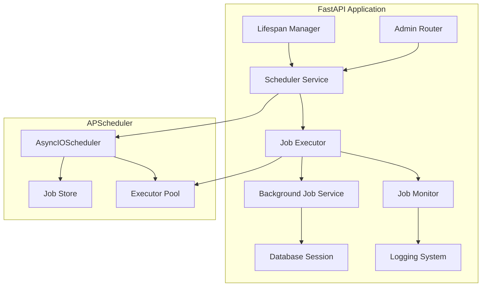
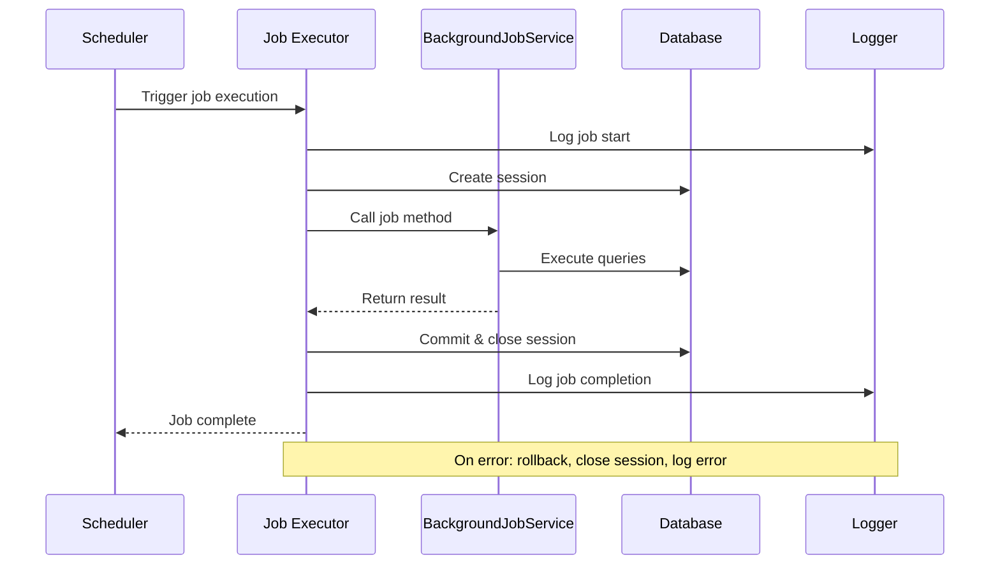

# Design Document: Background Task Scheduler

## Overview

The background task scheduler feature implements APScheduler to execute critical background jobs in the ride-hailing platform. The existing `BackgroundJobService` contains six essential methods that need scheduled execution: insurance expiry checks, route deviation monitoring, daily counter resets, scheduled ride processing, and driver suspension management. These jobs are currently not running, creating operational gaps in driver management, safety monitoring, and scheduled ride functionality.

This design integrates APScheduler's `AsyncIOScheduler` with FastAPI's lifespan events to provide reliable, production-ready task scheduling. The scheduler will manage job execution with proper error handling, database session management, logging, and graceful shutdown capabilities. An admin API endpoint will provide visibility into scheduler status and job execution history.

### Key Design Goals

- Integrate APScheduler seamlessly with FastAPI's async architecture
- Execute existing background jobs at appropriate intervals without code changes
- Provide robust error handling to prevent job failures from affecting other jobs
- Implement proper database session management for each job execution
- Enable monitoring and observability through logging and status endpoints
- Support graceful shutdown with job completion guarantees

## Architecture

### Component Overview



### Scheduler Lifecycle

The scheduler follows FastAPI's application lifecycle:

1. **Startup Phase**: Lifespan context manager initializes scheduler, registers all jobs, and starts execution
2. **Runtime Phase**: Scheduler executes jobs according to their schedules, with error handling and logging
3. **Shutdown Phase**: Scheduler stops accepting new jobs, waits for running jobs to complete (with timeout), and releases resources

### Job Execution Flow



## Components and Interfaces

### SchedulerService

The central component managing APScheduler lifecycle and job registration.

```python
class SchedulerService:
    """Manages APScheduler lifecycle and job registration."""
    
    def __init__(self):
        """Initialize scheduler with AsyncIOScheduler."""
        self.scheduler: Optional[AsyncIOScheduler] = None
        self.job_history: Dict[str, JobExecutionInfo] = {}
    
    async def start(self) -> None:
        """Initialize and start the scheduler."""
        
    async def shutdown(self, timeout: int = 30) -> None:
        """Gracefully shutdown scheduler."""
        
    def register_jobs(self) -> None:
        """Register all background jobs with their schedules."""
        
    def get_status(self) -> Dict[str, Any]:
        """Get scheduler status and job information."""
```

**Configuration**:
- Scheduler type: `AsyncIOScheduler` (compatible with FastAPI's async runtime)
- Timezone: UTC for consistent scheduling across deployments
- Job defaults: `coalesce=True` (skip missed runs), `max_instances=1` (prevent concurrent execution)
- Misfire grace time: 60 seconds (allow delayed starts)

### JobExecutor

Wraps background job execution with error handling, session management, and logging.

```python
class JobExecutor:
    """Executes background jobs with proper error handling and session management."""
    
    @staticmethod
    async def execute_job(
        job_name: str,
        job_func: Callable,
        *args,
        **kwargs
    ) -> Any:
        """
        Execute a background job with error handling and logging.
        
        - Creates database session
        - Logs execution start/end
        - Handles errors gracefully
        - Ensures session cleanup
        """
```

**Responsibilities**:
- Database session lifecycle management (create, commit/rollback, close)
- Exception catching and logging
- Execution timing and metrics collection
- Result logging and history tracking

### Job Registration

Each background job is registered with specific schedule parameters:

| Job Method | Schedule | Trigger Type | Parameters |
|------------|----------|--------------|------------|
| `check_insurance_expiry` | Daily at 00:00 UTC | cron | hour=0, minute=0 |
| `check_route_deviations` | Every 30 seconds | interval | seconds=30 |
| `reset_daily_cancellation_counts` | Daily at 00:00 UTC | cron | hour=0, minute=0 |
| `unsuspend_drivers_after_24_hours` | Every hour | interval | hours=1 |
| `reset_daily_availability_hours` | Daily at 00:00 UTC | cron | hour=0, minute=0 |
| `process_scheduled_rides` | Every minute | interval | minutes=1 |

### Admin API Endpoint

```python
@router.get("/admin/scheduler/status")
async def get_scheduler_status(
    current_user: User = Depends(require_admin)
) -> SchedulerStatusResponse:
    """
    Get scheduler status and job information.
    
    Returns:
        - Scheduler running state
        - List of registered jobs
        - Next run time for each job
        - Last execution time and result
        - Job execution history
    """
```

**Response Schema**:
```python
class JobInfo(BaseModel):
    job_id: str
    name: str
    next_run_time: Optional[datetime]
    last_run_time: Optional[datetime]
    last_run_status: Optional[str]
    last_run_duration: Optional[float]

class SchedulerStatusResponse(BaseModel):
    running: bool
    jobs: List[JobInfo]
    total_executions: int
    failed_executions: int
```

## Data Models

### JobExecutionInfo

Tracks execution history for monitoring and debugging.

```python
@dataclass
class JobExecutionInfo:
    """Information about a job execution."""
    job_name: str
    start_time: datetime
    end_time: Optional[datetime] = None
    status: str = "running"  # running, success, failed
    result: Optional[Any] = None
    error: Optional[str] = None
    duration_seconds: Optional[float] = None
```

### Configuration Model

Environment-based configuration for scheduler behavior.

```python
class SchedulerConfig(BaseModel):
    """Scheduler configuration from environment variables."""
    enabled: bool = True
    timezone: str = "UTC"
    misfire_grace_time: int = 60
    shutdown_timeout: int = 30
    job_store_type: str = "memory"  # memory or sqlalchemy
    job_store_url: Optional[str] = None
```

**Environment Variables**:
- `SCHEDULER_ENABLED`: Enable/disable scheduler (default: true)
- `SCHEDULER_TIMEZONE`: Timezone for scheduling (default: UTC)
- `SCHEDULER_MISFIRE_GRACE_TIME`: Seconds to allow delayed starts (default: 60)
- `SCHEDULER_SHUTDOWN_TIMEOUT`: Max seconds to wait for job completion on shutdown (default: 30)
- `SCHEDULER_JOB_STORE`: Job store type - "memory" or "sqlalchemy" (default: memory)
- `SCHEDULER_JOB_STORE_URL`: Database URL for persistent job store (optional)


## Correctness Properties

*A property is a characteristic or behavior that should hold true across all valid executions of a system—essentially, a formal statement about what the system should do. Properties serve as the bridge between human-readable specifications and machine-verifiable correctness guarantees.*

### Property 1: Job Execution Error Isolation

*For any* background job that raises an exception during execution, the job executor shall catch the exception, log it with full traceback including job name, execution time, and error details, and the scheduler shall continue scheduling future executions of that job and all other jobs without interruption.

**Validates: Requirements 10.1, 10.2, 10.3, 10.5**

### Property 2: Comprehensive Job Execution Logging

*For any* background job execution, the job monitor shall log the job name and start time when execution begins, and upon completion shall log the job name, duration, and either result summary (at INFO level) for successful executions or error details (at ERROR level) for failed executions.

**Validates: Requirements 11.1, 11.2, 11.3, 11.4, 11.5**

### Property 3: Database Session Lifecycle Management

*For any* background job execution, the job executor shall create a new database session before execution, close the session after successful completion, and rollback then close the session if an exception occurs, ensuring no session is reused across multiple job executions.

**Validates: Requirements 13.1, 13.2, 13.3, 13.5**

## Error Handling

### Job Execution Errors

All background job executions are wrapped in comprehensive error handling:

```python
async def execute_job(job_name: str, job_func: Callable, *args, **kwargs):
    session = None
    start_time = datetime.utcnow()
    
    try:
        logger.info(f"Starting job: {job_name}")
        session = SessionLocal()
        
        result = await job_func(session, *args, **kwargs)
        
        session.commit()
        duration = (datetime.utcnow() - start_time).total_seconds()
        logger.info(f"Job {job_name} completed in {duration}s: {result}")
        
        return result
        
    except Exception as e:
        if session:
            session.rollback()
        
        duration = (datetime.utcnow() - start_time).total_seconds()
        logger.error(
            f"Job {job_name} failed after {duration}s: {str(e)}",
            exc_info=True
        )
        # Do not re-raise - allow scheduler to continue
        
    finally:
        if session:
            session.close()
```

**Error Handling Principles**:
- Exceptions are caught at the job executor level, never propagated to scheduler
- All errors are logged with full context (job name, timing, traceback)
- Database sessions are always cleaned up (rollback on error, close in finally)
- Scheduler continues operating regardless of individual job failures
- Job schedules remain active after failures

### Scheduler Lifecycle Errors

Errors during scheduler startup or shutdown are handled differently:

- **Startup errors**: Logged and re-raised to prevent application start with broken scheduler
- **Shutdown errors**: Logged but not re-raised to allow graceful application shutdown
- **Job registration errors**: Logged and re-raised to ensure all jobs are properly configured

### Database Connection Errors

Database connection failures in background jobs:

- Caught and logged like any other job error
- Job continues to be scheduled (connection may recover)
- Monitoring alerts should be configured for repeated database errors
- Consider implementing exponential backoff for jobs with repeated failures (future enhancement)

### Timeout Handling

Long-running jobs are managed through:

- APScheduler's `misfire_grace_time`: Jobs that miss their scheduled time by more than grace period are skipped
- Shutdown timeout: Jobs running during shutdown have 30 seconds to complete before forced termination
- No per-job timeout by default (jobs should implement their own timeouts if needed)

## Testing Strategy

### Unit Testing Approach

Unit tests focus on specific examples, edge cases, and component behavior:

**Scheduler Configuration Tests**:
- Verify AsyncIOScheduler is instantiated with correct parameters
- Verify timezone is set to UTC
- Verify job_defaults (coalesce=True, max_instances=1)
- Verify misfire_grace_time configuration
- Test configuration loading from environment variables

**Job Registration Tests**:
- Verify each of the 6 background jobs is registered
- Verify correct schedule for each job (cron vs interval, timing parameters)
- Verify job IDs and names are set correctly
- Test that all jobs are present in scheduler after registration

**Job Executor Tests**:
- Test successful job execution with mocked BackgroundJobService
- Test job execution with exception (verify error handling)
- Test database session creation and cleanup
- Test logging output for success and failure cases
- Test that exceptions don't propagate to scheduler

**Lifecycle Tests**:
- Test scheduler startup (initialization and start)
- Test scheduler shutdown (graceful stop)
- Test shutdown with running jobs (timeout behavior)
- Test shutdown with long-running job (forced termination)

**Admin API Tests**:
- Test /admin/scheduler/status endpoint response structure
- Test authentication requirement (reject non-admin users)
- Test status response includes all registered jobs
- Test status response includes next run times
- Test status response includes execution history

**Persistence Tests**:
- Test in-memory job store configuration
- Test SQLAlchemy job store configuration
- Test job restoration after restart (with persistent store)
- Test configuration via environment variables

### Property-Based Testing Approach

Property-based tests verify universal properties across all jobs using randomization and generative testing. Each test runs a minimum of 100 iterations.

**Property Test 1: Job Execution Error Isolation**
```python
@given(
    job_name=st.text(min_size=1),
    exception_type=st.sampled_from([ValueError, RuntimeError, Exception])
)
@settings(max_examples=100)
def test_job_error_isolation(job_name, exception_type):
    """
    Feature: background-task-scheduler, Property 1: For any background job 
    that raises an exception during execution, the job executor shall catch 
    the exception, log it with full traceback, and the scheduler shall 
    continue scheduling future executions.
    """
    # Create mock job that raises exception
    # Execute job through executor
    # Verify exception is caught (no propagation)
    # Verify error is logged with traceback
    # Verify job remains scheduled
```

**Property Test 2: Comprehensive Job Execution Logging**
```python
@given(
    job_name=st.text(min_size=1),
    should_succeed=st.booleans()
)
@settings(max_examples=100)
def test_job_execution_logging(job_name, should_succeed):
    """
    Feature: background-task-scheduler, Property 2: For any background job 
    execution, the job monitor shall log the job name and start time when 
    execution begins, and upon completion shall log the job name, duration, 
    and either result summary (INFO level) or error details (ERROR level).
    """
    # Create mock job that succeeds or fails based on parameter
    # Execute job through executor
    # Verify start log contains job name and timestamp
    # Verify completion log contains job name and duration
    # Verify log level is INFO for success, ERROR for failure
```

**Property Test 3: Database Session Lifecycle Management**
```python
@given(
    job_name=st.text(min_size=1),
    should_fail=st.booleans()
)
@settings(max_examples=100)
def test_session_lifecycle(job_name, should_fail):
    """
    Feature: background-task-scheduler, Property 3: For any background job 
    execution, the job executor shall create a new database session before 
    execution, close the session after successful completion, and rollback 
    then close the session if an exception occurs, ensuring no session is 
    reused across multiple job executions.
    """
    # Track session creation and cleanup
    # Execute job (succeeding or failing based on parameter)
    # Verify new session was created
    # Verify session was committed (success) or rolled back (failure)
    # Verify session was closed
    # Execute job again and verify different session is used
```

### Integration Testing

Integration tests verify end-to-end scheduler behavior:

- Test full application lifecycle with scheduler (startup, operation, shutdown)
- Test actual job execution with real BackgroundJobService and test database
- Test multiple jobs running concurrently (verify isolation)
- Test job execution timing (verify schedules are honored)
- Test persistence across application restarts
- Test admin API with running scheduler

### Testing Tools

- **pytest**: Test framework
- **pytest-asyncio**: Async test support
- **hypothesis**: Property-based testing library for Python
- **freezegun**: Time mocking for schedule testing
- **pytest-mock**: Mocking support
- **testcontainers**: Database containers for integration tests

### Test Coverage Goals

- Unit test coverage: >90% for scheduler service and job executor
- Property test coverage: All universal properties (error handling, logging, session management)
- Integration test coverage: All job types, lifecycle events, persistence modes
- Example test coverage: All specific job schedules, configuration options, API endpoints

