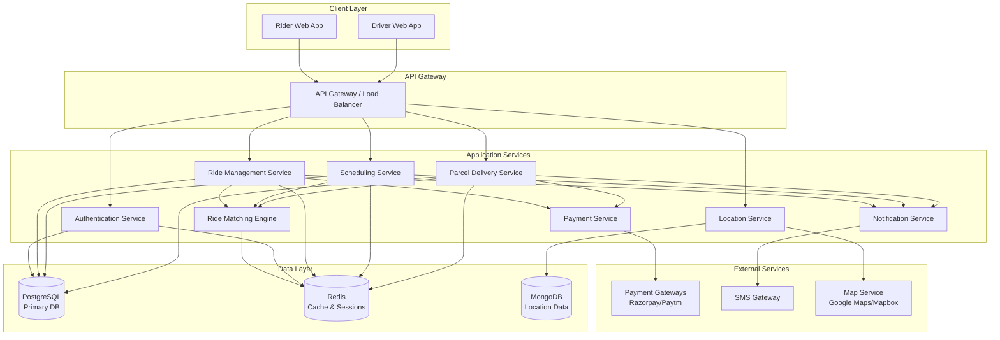

# Design Document: Ride-Hailing Platform

## Overview

The ride-hailing platform is a web-first application that connects riders with drivers for intra-city transportation within Indore and its surrounding areas (20km radius). The system supports both immediate and scheduled rides, as well as peer-to-peer parcel delivery services. The architecture follows a client-server model with real-time communication capabilities, integrating with external services for payments, mapping, and notifications.

The platform consists of three main layers:
1. **Presentation Layer**: Web application providing interfaces for riders and drivers
2. **Application Layer**: Business logic, ride matching algorithms, scheduling, and orchestration
3. **Data Layer**: Persistent storage for users, rides, parcels, transactions, and system state

Key design principles:
- Real-time responsiveness for ride matching and tracking
- Security-first approach for user data and financial transactions
- Scalability to support growth beyond initial deployment
- Modular architecture enabling feature additions and service area expansion
- Flexible scheduling system for planned trips
- Robust parcel tracking and confirmation workflows

## Architecture

### System Components



### Communication Patterns

**Synchronous Communication**:
- REST APIs for standard CRUD operations (user management, ride history)
- Request-response pattern for ride requests, cancellations

**Asynchronous Communication**:
- WebSocket connections for real-time location updates
- WebSocket for ride status notifications and driver matching
- Event-driven architecture for payment processing and notifications

**Data Flow Example - Ride Request**:
1. Rider submits ride request via web app
2. API Gateway authenticates and routes to Ride Service
3. Ride Service validates locations and calculates fare
4. Matching Engine broadcasts to available drivers (via WebSocket)
5. Driver accepts via WebSocket
6. Matching Engine creates ride match
7. Both parties receive real-time updates via WebSocket

## Components and Interfaces

### Authentication Service

**Responsibilities**:
- User registration and login
- Phone verification via SMS OTP
- ID document verification for drivers
- Session management
- JWT token generation and validation

**Key Interfaces**:

```typescript
interface AuthService {
  // User registration
  registerUser(userData: UserRegistration): Promise<UserAccount>
  
  // Phone verification
  sendVerificationCode(phoneNumber: string): Promise<VerificationSession>
  verifyCode(sessionId: string, code: string): Promise<VerificationResult>
  
  // ID verification for drivers
  submitIDDocument(userId: string, document: IDDocument): Promise<VerificationStatus>
  verifyIDDocument(documentId: string): Promise<VerificationResult>
  
  // Authentication
  login(credentials: LoginCredentials): Promise<AuthToken>
  validateToken(token: string): Promise<TokenValidation>
  logout(token: string): Promise<void>
}

interface UserRegistration {
  phoneNumber: string
  name: string
  email: string
  userType: 'rider' | 'driver'
  vehicleDetails?: VehicleInfo  // Required for drivers
}

interface VerificationSession {
  sessionId: string
  expiresAt: Date
  attemptsRemaining: number
}

interface IDDocument {
  documentType: 'drivers_license' | 'aadhaar' | 'pan'
  documentNumber: string
  documentImage: Buffer
}
```

### Ride Management Service

**Responsibilities**:
- Create and manage ride requests
- Handle ride lifecycle (requested → matched → in-progress → completed)
- Coordinate with matching engine
- Manage cancellations
- Store ride history

**Key Interfaces**:

```typescript
interface RideService {
  // Ride request management
  createRideRequest(request: RideRequest): Promise<RideRequestResult>
  cancelRideRequest(requestId: string, userId: string): Promise<CancellationResult>
  
  // Ride lifecycle
  startRide(rideId: string, driverId: string): Promise<RideSession>
  completeRide(rideId: string, actualDistance: number): Promise<CompletedRide>
  
  // Ride history
  getRideHistory(userId: string, filters: HistoryFilters): Promise<Ride[]>
  getRideDetails(rideId: string): Promise<RideDetails>
  
  // Driver operations
  acceptRide(rideId: string, driverId: string): Promise<RideMatch>
  rejectRide(rideId: string, driverId: string): Promise<void>
}

interface RideRequest {
  riderId: string
  pickupLocation: Location
  destination: Location
  requestedAt: Date
}

interface RideRequestResult {
  requestId: string
  estimatedFare: number
  estimatedArrival: number  // minutes
  fareBreakdown: FareBreakdown
}

interface Location {
  latitude: number
  longitude: number
  address: string
}

interface RideSession {
  rideId: string
  riderId: string
  driverId: string
  status: 'matched' | 'in_progress' | 'completed' | 'cancelled'
  pickupLocation: Location
  destination: Location
  startTime: Date
}
```

### Ride Matching Engine

**Responsibilities**:
- Broadcast ride requests to available drivers
- Match riders with optimal drivers based on proximity
- Handle concurrent acceptance scenarios
- Manage driver availability state
- Support extended area matching with adjusted search radius
- Handle both ride and parcel delivery matching

**Key Interfaces**:

```typescript
interface MatchingEngine {
  // Matching operations
  broadcastRideRequest(request: RideRequest, searchRadius: number): Promise<BroadcastResult>
  broadcastParcelRequest(request: ParcelDeliveryRequest, searchRadius: number): Promise<BroadcastResult>
  matchRide(requestId: string, driverId: string): Promise<RideMatch>
  matchParcel(deliveryId: string, driverId: string): Promise<ParcelMatch>
  
  // Driver availability
  setDriverAvailable(driverId: string, location: Location): Promise<void>
  setDriverUnavailable(driverId: string): Promise<void>
  getAvailableDrivers(location: Location, radius: number, extendedAreaEnabled?: boolean): Promise<Driver[]>
  
  // Matching algorithm
  findOptimalDriver(request: RideRequest | ParcelDeliveryRequest, candidates: Driver[]): Promise<Driver>
}

interface BroadcastResult {
  notifiedDrivers: string[]  // driver IDs
  searchRadius: number
  broadcastTime: Date
}

interface RideMatch {
  rideId: string
  riderId: string
  driverId: string
  matchedAt: Date
  estimatedArrival: number
}
```

**Matching Algorithm with Extended Area Support**:

The matching engine uses a proximity-based algorithm with adjusted parameters for extended area:

1. Determine if pickup is in extended area
2. Set initial search radius: 5km for city center, 8km for extended area
3. Find all available drivers within radius
4. Filter drivers by extended area preference if applicable
5. Sort drivers by distance (closest first)
6. Notify drivers in batches (closest 5 drivers first)
7. If no acceptance within 30 seconds, notify next batch
8. If no acceptance within timeout (2 min city, 3 min extended), expand radius
9. Radius expansion: +2km for city center, +3km for extended area
10. On concurrent acceptances, assign to closest driver

```
function matchDriver(request: RideRequest, drivers: Driver[]): Driver {
  // Check if pickup is in extended area
  isExtended = locationService.isInExtendedArea(request.pickupLocation)
  
  // Filter available drivers
  available = drivers.filter(d => d.status === 'available')
  
  // Filter by extended area preference if needed
  if (isExtended) {
    available = available.filter(d => d.preferences.acceptExtendedArea !== false)
  }
  
  // Calculate distances
  withDistances = available.map(d => ({
    driver: d,
    distance: calculateDistance(d.location, request.pickupLocation)
  }))
  
  // Sort by distance
  sorted = withDistances.sort((a, b) => a.distance - b.distance)
  
  // Return closest
  return sorted[0].driver
}

function getInitialSearchRadius(location: Location): number {
  isExtended = locationService.isInExtendedArea(location)
  return isExtended ? 8 : 5  // km
}

function getRadiusExpansion(location: Location): number {
  isExtended = locationService.isInExtendedArea(location)
  return isExtended ? 3 : 2  // km
}

function getMatchingTimeout(location: Location): number {
  isExtended = locationService.isInExtendedArea(location)
  return isExtended ? 180 : 120  // seconds
}
```

### Payment Service

**Responsibilities**:
- Calculate fares based on distance
- Process payments through external gateways
- Handle payment retries and failures
- Manage driver payouts
- Store transaction records

**Key Interfaces**:

```typescript
interface PaymentService {
  // Fare calculation
  calculateEstimatedFare(distance: number, surgeMultiplier?: number): Promise<FareCalculation>
  calculateFinalFare(ride: CompletedRide): Promise<FareCalculation>
  
  // Payment processing
  processPayment(rideId: string, amount: number, gateway: PaymentGateway): Promise<PaymentResult>
  retryPayment(transactionId: string): Promise<PaymentResult>
  
  // Driver payouts
  scheduleDriverPayout(driverId: string, amount: number): Promise<PayoutSchedule>
  processPayouts(): Promise<PayoutResult[]>
  
  // Transaction history
  getTransactionHistory(userId: string): Promise<Transaction[]>
}

interface FareCalculation {
  baseFare: number
  distanceCharge: number
  surgeMultiplier: number
  totalFare: number
  breakdown: {
    base: number
    perKm: number
    distance: number
    surge: number
  }
}

interface PaymentResult {
  transactionId: string
  status: 'success' | 'failed' | 'pending'
  gateway: 'razorpay' | 'paytm'
  amount: number
  timestamp: Date
  gatewayResponse?: any
}
```

**Fare Calculation Logic**:

```
baseFare = 30  // ₹30
perKmRate = 12  // ₹12/km for first 25km
perKmRateExtended = 10  // ₹10/km beyond 25km
surgeMultiplier = 1.0  // default, can increase during high demand

function calculateRideFare(distance: number, surgeMultiplier: number = 1.0): number {
  if (distance <= 25) {
    fare = baseFare + (distance * perKmRate)
  } else {
    // First 25km at regular rate, rest at reduced rate
    fare = baseFare + (25 * perKmRate) + ((distance - 25) * perKmRateExtended)
  }
  
  estimatedFare = fare * surgeMultiplier
  return estimatedFare
}

// Final fare protection
if (abs(finalFare - estimatedFare) / estimatedFare > 0.20) {
  finalFare = estimatedFare  // Cap at estimated if difference > 20%
}
```

### Location Service

**Responsibilities**:
- Track real-time driver locations
- Validate addresses within expanded service boundaries (Indore + 20km radius)
- Calculate distances and routes
- Provide map data for UI
- Detect route deviations
- Distinguish between city center and extended area locations

**Key Interfaces**:

```typescript
interface LocationService {
  // Location tracking
  updateDriverLocation(driverId: string, location: Location): Promise<void>
  getDriverLocation(driverId: string): Promise<Location>
  subscribeToLocationUpdates(driverId: string, callback: LocationCallback): Promise<Subscription>
  
  // Address validation
  validateAddress(address: string): Promise<ValidationResult>
  isWithinServiceArea(location: Location): Promise<boolean>
  isInExtendedArea(location: Location): Promise<boolean>
  searchAddress(query: string): Promise<Address[]>
  
  // Distance and routing
  calculateDistance(from: Location, to: Location): Promise<number>
  getRoute(from: Location, to: Location): Promise<Route>
  detectRouteDeviation(currentLocation: Location, expectedRoute: Route): Promise<DeviationAlert>
}

interface ValidationResult {
  valid: boolean
  inServiceArea: boolean
  inExtendedArea: boolean
  normalizedAddress: string
}

interface Route {
  distance: number  // kilometers
  duration: number  // minutes
  polyline: string  // encoded polyline
  waypoints: Location[]
}

interface DeviationAlert {
  isDeviated: boolean
  deviationDistance: number  // meters
  currentLocation: Location
  expectedLocation: Location
}
```

**Service Area Boundaries**:

```
// Indore city center (approximate)
cityCenterLat = 22.7196
cityCenterLon = 75.8577

// Service area: 20km radius from city center
serviceAreaRadius = 20  // kilometers

function isWithinServiceArea(location: Location): boolean {
  distance = calculateDistance(
    {lat: cityCenterLat, lon: cityCenterLon},
    location
  )
  return distance <= serviceAreaRadius
}

// Extended area: beyond original city limits but within 20km
// Original city limits (approximate rectangular bounds)
cityLimits = {
  minLat: 22.6,
  maxLat: 22.8,
  minLon: 75.7,
  maxLon: 75.9
}

function isInExtendedArea(location: Location): boolean {
  inServiceArea = isWithinServiceArea(location)
  inCityLimits = (
    location.lat >= cityLimits.minLat &&
    location.lat <= cityLimits.maxLat &&
    location.lon >= cityLimits.minLon &&
    location.lon <= cityLimits.maxLon
  )
  return inServiceArea && !inCityLimits
}
```

### Notification Service

**Responsibilities**:
- Send SMS notifications for critical events
- Send in-app notifications via WebSocket
- Manage notification preferences
- Handle emergency alerts

**Key Interfaces**:

```typescript
interface NotificationService {
  // SMS notifications
  sendSMS(phoneNumber: string, message: string): Promise<SMSResult>
  sendVerificationCode(phoneNumber: string, code: string): Promise<SMSResult>
  
  // In-app notifications
  sendInAppNotification(userId: string, notification: Notification): Promise<void>
  broadcastToUser(userId: string, event: RideEvent): Promise<void>
  
  // Emergency notifications
  sendEmergencyAlert(rideId: string, location: Location): Promise<void>
  notifyEmergencyContacts(userId: string, message: string): Promise<void>
}

interface Notification {
  type: 'ride_matched' | 'driver_arrived' | 'ride_completed' | 'payment_success' | 'emergency' | 'scheduled_reminder' | 'parcel_pickup' | 'parcel_delivered'
  title: string
  message: string
  data?: any
  timestamp: Date
}
```

### Scheduling Service

**Responsibilities**:
- Manage scheduled ride requests
- Trigger matching at appropriate times
- Handle scheduled ride modifications and cancellations
- Send reminder notifications
- Track scheduled ride status

**Key Interfaces**:

```typescript
interface SchedulingService {
  // Scheduled ride management
  createScheduledRide(request: ScheduledRideRequest): Promise<ScheduledRide>
  modifyScheduledRide(rideId: string, updates: ScheduledRideUpdate): Promise<ScheduledRide>
  cancelScheduledRide(rideId: string, userId: string): Promise<CancellationResult>
  
  // Scheduled ride retrieval
  getScheduledRides(userId: string): Promise<ScheduledRide[]>
  getScheduledRideDetails(rideId: string): Promise<ScheduledRide>
  
  // Matching trigger
  triggerScheduledMatching(rideId: string): Promise<void>
  
  // Reminders
  sendScheduledReminders(): Promise<void>
}

interface ScheduledRideRequest {
  riderId: string
  pickupLocation: Location
  destination: Location
  scheduledPickupTime: Date
  requestedAt: Date
}

interface ScheduledRideUpdate {
  pickupLocation?: Location
  destination?: Location
  scheduledPickupTime?: Date
}

interface ScheduledRide {
  rideId: string
  riderId: string
  pickupLocation: Location
  destination: Location
  scheduledPickupTime: Date
  estimatedFare: number
  status: 'scheduled' | 'matching' | 'matched' | 'cancelled' | 'completed'
  driverId?: string
  matchedAt?: Date
  createdAt: Date
  modifiedAt?: Date
}
```

**Scheduling Logic**:

The scheduling service uses a background job to monitor scheduled rides:

1. Every minute, check for scheduled rides where `scheduledPickupTime - 30 minutes <= now`
2. For each eligible ride, change status to "matching" and trigger matching engine
3. Send reminder to rider at 15 minutes before scheduled time
4. Send reminder to matched driver at 15 minutes before scheduled time
5. If no driver matched within 15 minutes of scheduled time, notify rider

```
function processScheduledRides() {
  now = getCurrentTime()
  matchingWindow = now + 30 minutes
  
  // Find rides ready for matching
  rides = getScheduledRides(status='scheduled', scheduledTime <= matchingWindow)
  
  for each ride in rides:
    ride.status = 'matching'
    matchingEngine.broadcastRideRequest(ride)
    
  // Send reminders
  reminderWindow = now + 15 minutes
  ridesForReminder = getScheduledRides(scheduledTime <= reminderWindow, reminderSent=false)
  
  for each ride in ridesForReminder:
    notificationService.sendReminder(ride.riderId, ride)
    if ride.driverId:
      notificationService.sendReminder(ride.driverId, ride)
    ride.reminderSent = true
}
```

### Parcel Delivery Service

**Responsibilities**:
- Manage parcel delivery requests
- Calculate parcel delivery fares
- Handle pickup and delivery confirmations
- Track parcel status and location
- Store parcel delivery history

**Key Interfaces**:

```typescript
interface ParcelService {
  // Parcel delivery management
  createParcelDelivery(request: ParcelDeliveryRequest): Promise<ParcelDelivery>
  cancelParcelDelivery(deliveryId: string, userId: string): Promise<CancellationResult>
  
  // Pickup and delivery confirmation
  confirmPickup(deliveryId: string, driverId: string, photo: Buffer, signature?: string): Promise<void>
  confirmDelivery(deliveryId: string, recipientId: string, photo: Buffer, signature?: string): Promise<void>
  
  // Parcel tracking
  getParcelStatus(deliveryId: string): Promise<ParcelDelivery>
  getParcelLocation(deliveryId: string): Promise<Location>
  
  // Parcel history
  getParcelHistory(userId: string, role: 'sender' | 'recipient'): Promise<ParcelDelivery[]>
  getParcelDetails(deliveryId: string): Promise<ParcelDeliveryDetails>
  
  // Driver operations
  acceptParcelDelivery(deliveryId: string, driverId: string): Promise<ParcelMatch>
  rejectParcelDelivery(deliveryId: string, driverId: string): Promise<void>
}

interface ParcelDeliveryRequest {
  senderId: string
  pickupLocation: Location
  recipientLocation: Location
  recipientPhone: string
  recipientName: string
  parcelDetails: ParcelDetails
  specialInstructions?: string
  requireSignature: boolean
  requestedAt: Date
}

interface ParcelDetails {
  size: 'small' | 'medium' | 'large'
  weight: number  // kilograms
  description: string
  fragile: boolean
  urgent: boolean
}

interface ParcelDelivery {
  deliveryId: string
  senderId: string
  recipientId?: string
  recipientPhone: string
  recipientName: string
  driverId?: string
  pickupLocation: Location
  recipientLocation: Location
  parcelDetails: ParcelDetails
  specialInstructions?: string
  requireSignature: boolean
  status: ParcelStatus
  estimatedFare: number
  finalFare?: number
  pickupPhoto?: string
  pickupSignature?: string
  deliveryPhoto?: string
  deliverySignature?: string
  estimatedDeliveryTime?: Date
  createdAt: Date
  pickedUpAt?: Date
  deliveredAt?: Date
}

type ParcelStatus = 
  | 'requested'
  | 'matched'
  | 'driver_arriving'
  | 'picked_up'
  | 'in_transit'
  | 'arriving_at_destination'
  | 'delivered'
  | 'cancelled'

interface ParcelMatch {
  deliveryId: string
  senderId: string
  driverId: string
  matchedAt: Date
  estimatedPickupTime: number
}
```

**Parcel Fare Calculation Logic**:

```
function calculateParcelFare(distance: number, size: ParcelSize): FareCalculation {
  // Base fare by size
  baseFare = {
    'small': 40,
    'medium': 60,
    'large': 80
  }[size]
  
  // Per km rate by size
  perKmRate = {
    'small': 8,
    'medium': 10,
    'large': 12
  }[size]
  
  distanceCharge = distance * perKmRate
  totalFare = baseFare + distanceCharge
  
  return {
    baseFare,
    distanceCharge,
    distance,
    totalFare,
    breakdown: {
      base: baseFare,
      perKm: perKmRate,
      distance: distance
    }
  }
}
```

## Data Models

### User Model

```typescript
interface User {
  userId: string
  phoneNumber: string
  phoneVerified: boolean
  name: string
  email: string
  userType: 'rider' | 'driver'
  createdAt: Date
  
  // Driver-specific fields
  driverProfile?: DriverProfile
  
  // Rider-specific fields
  emergencyContacts?: EmergencyContact[]
  
  // Ratings
  averageRating: number
  totalRides: number
  totalParcels?: number  // For drivers
}

interface DriverProfile {
  licenseNumber: string
  licenseVerified: boolean
  vehicleInfo: VehicleInfo
  insuranceExpiry: Date
  status: 'available' | 'unavailable' | 'busy'
  currentLocation?: Location
  totalEarnings: number
  cancellationCount: number
  lastCancellationReset: Date
  
  // Extended area preferences
  preferences: DriverPreferences
  
  // Statistics
  extendedAreaRidePercentage: number
}

interface DriverPreferences {
  acceptExtendedArea: boolean
  acceptParcelDelivery: boolean
}

interface VehicleInfo {
  registrationNumber: string
  make: string
  model: string
  color: string
  verified: boolean
}

interface EmergencyContact {
  name: string
  phoneNumber: string
  relationship: string
}
```

### Ride Model

```typescript
interface Ride {
  rideId: string
  riderId: string
  driverId: string
  status: RideStatus
  
  // Locations
  pickupLocation: Location
  destination: Location
  actualRoute?: Location[]
  
  // Timing
  requestedAt: Date
  matchedAt?: Date
  pickupTime?: Date
  startTime?: Date
  completedAt?: Date
  
  // Fare
  estimatedFare: number
  finalFare?: number
  fareBreakdown: FareBreakdown
  
  // Payment
  paymentStatus: 'pending' | 'completed' | 'failed'
  transactionId?: string
  
  // Ratings
  riderRating?: Rating
  driverRating?: Rating
  
  // Cancellation
  cancelledBy?: string
  cancellationReason?: string
  cancellationFee?: number
}

type RideStatus = 
  | 'requested'
  | 'matched'
  | 'driver_arriving'
  | 'in_progress'
  | 'completed'
  | 'cancelled'

interface FareBreakdown {
  baseFare: number
  distanceCharge: number
  distance: number
  surgeMultiplier: number
  totalFare: number
}

interface Rating {
  stars: number  // 1-5
  review?: string
  timestamp: Date
}
```

### Transaction Model

```typescript
interface Transaction {
  transactionId: string
  rideId: string
  riderId: string
  driverId: string
  amount: number
  gateway: 'razorpay' | 'paytm'
  status: 'pending' | 'success' | 'failed'
  gatewayTransactionId?: string
  gatewayResponse?: any
  retryCount: number
  createdAt: Date
  completedAt?: Date
}

interface DriverPayout {
  payoutId: string
  driverId: string
  amount: number
  rides: string[]  // ride IDs
  status: 'scheduled' | 'processing' | 'completed' | 'failed'
  scheduledFor: Date
  processedAt?: Date
  bankAccount: string
}
```

### Session and State Models

```typescript
interface VerificationSession {
  sessionId: string
  phoneNumber: string
  code: string
  createdAt: Date
  expiresAt: Date
  attempts: number
  verified: boolean
}

interface RideRequest {
  requestId: string
  riderId: string
  pickupLocation: Location
  destination: Location
  estimatedFare: number
  status: 'broadcasting' | 'matched' | 'expired' | 'cancelled'
  notifiedDrivers: string[]
  searchRadius: number
  broadcastCount: number
  createdAt: Date
  expiresAt: Date
  isExtendedArea: boolean
}
```

### Scheduled Ride Model

```typescript
interface ScheduledRide {
  rideId: string
  riderId: string
  pickupLocation: Location
  destination: Location
  scheduledPickupTime: Date
  estimatedFare: number
  fareBreakdown: FareBreakdown
  status: ScheduledRideStatus
  driverId?: string
  matchedAt?: Date
  reminderSent: boolean
  createdAt: Date
  modifiedAt?: Date
  cancelledAt?: Date
  cancellationReason?: string
  cancellationFee?: number
}

type ScheduledRideStatus = 
  | 'scheduled'
  | 'matching'
  | 'matched'
  | 'driver_arriving'
  | 'in_progress'
  | 'completed'
  | 'cancelled'
  | 'no_driver_found'
```

### Parcel Delivery Model

```typescript
interface ParcelDelivery {
  deliveryId: string
  senderId: string
  recipientPhone: string
  recipientName: string
  recipientId?: string  // If recipient is a registered user
  driverId?: string
  pickupLocation: Location
  recipientLocation: Location
  parcelDetails: ParcelDetails
  specialInstructions?: string
  requireSignature: boolean
  status: ParcelStatus
  estimatedFare: number
  finalFare?: number
  fareBreakdown: ParcelFareBreakdown
  
  // Confirmation data
  pickupPhoto?: string  // URL or base64
  pickupSignature?: string
  pickupConfirmedAt?: Date
  deliveryPhoto?: string
  deliverySignature?: string
  deliveryConfirmedAt?: Date
  
  // Timing
  estimatedDeliveryTime?: Date
  createdAt: Date
  matchedAt?: Date
  pickedUpAt?: Date
  deliveredAt?: Date
  cancelledAt?: Date
  
  // Payment
  paymentStatus: 'pending' | 'completed' | 'failed'
  transactionId?: string
  
  // Tracking
  actualRoute?: Location[]
}

interface ParcelDetails {
  size: 'small' | 'medium' | 'large'
  weight: number  // kilograms
  description: string
  fragile: boolean
  urgent: boolean
}

type ParcelStatus = 
  | 'requested'
  | 'matched'
  | 'driver_arriving_pickup'
  | 'picked_up'
  | 'in_transit'
  | 'driver_arriving_destination'
  | 'delivered'
  | 'cancelled'

interface ParcelFareBreakdown {
  baseFare: number
  distanceCharge: number
  distance: number
  totalFare: number
  sizeCategory: 'small' | 'medium' | 'large'
}
```


## Correctness Properties

A property is a characteristic or behavior that should hold true across all valid executions of a system—essentially, a formal statement about what the system should do. Properties serve as the bridge between human-readable specifications and machine-verifiable correctness guarantees.

### Authentication and Verification Properties

**Property 1: Registration data completeness**
*For any* user registration attempt, the system should accept and store all required fields (phone number, name, email) and for driver registrations, additionally require vehicle details (registration number, make, model, color).
**Validates: Requirements 1.1, 10.1**

**Property 2: Verification code round-trip**
*For any* phone number, sending a verification code and then verifying with that same code within the time limit should result in the phone being marked as verified.
**Validates: Requirements 1.2, 1.3**

**Property 3: Verification attempt limiting**
*For any* verification session, after 3 incorrect code attempts, further verification attempts should be blocked for 30 minutes.
**Validates: Requirements 1.4**

**Property 4: Driver ID requirement enforcement**
*For any* driver registration attempt without ID documents, the registration should fail, and for any driver registration with ID documents, the verification process should be initiated.
**Validates: Requirements 1.5**

**Property 5: Credential encryption**
*For any* stored user credentials, the password should be hashed (not stored in plain text) using a cryptographic hash function.
**Validates: Requirements 1.7**

**Property 6: Authentication session creation**
*For any* registered user with valid credentials, logging in should create an authenticated session with a valid token.
**Validates: Requirements 1.8**

### Ride Request Properties

**Property 7: Valid ride request creation**
*For any* verified rider with pickup and destination locations within Indore boundaries, creating a ride request should succeed and return a request ID.
**Validates: Requirements 2.1**

**Property 8: Boundary validation**
*For any* ride request where either pickup or destination is outside Indore city limits, the request should be rejected with an error message.
**Validates: Requirements 2.4**

**Property 9: Ride request completeness**
*For any* created ride request, it should include estimated fare, fare breakdown, and estimated arrival time.
**Validates: Requirements 2.2, 2.5**

**Property 10: Ride request broadcasting**
*For any* confirmed ride request, the system should broadcast to available drivers and record which drivers were notified.
**Validates: Requirements 2.3**

### Driver Matching Properties

**Property 11: Proximity-based notification**
*For any* ride request broadcast, only drivers within the specified search radius of the pickup location should receive notifications.
**Validates: Requirements 3.1**

**Property 12: Notification content completeness**
*For any* ride request notification sent to a driver, it should include pickup location, destination, and estimated fare.
**Validates: Requirements 3.2**

**Property 13: Ride match creation**
*For any* driver acceptance of a ride request, a ride match should be created linking the rider and driver, and both parties should be notified.
**Validates: Requirements 3.3**

**Property 14: Continued broadcasting after rejection**
*For any* ride request where a driver rejects, other available drivers should still be eligible to receive the request.
**Validates: Requirements 3.4**

**Property 15: Search radius expansion**
*For any* ride request with no acceptance within the timeout period, the search radius should increase by 2km and re-broadcast should occur.
**Validates: Requirements 3.5**

**Property 16: Closest driver selection**
*For any* ride request with multiple concurrent driver acceptances, the system should assign the ride to the driver closest to the pickup location.
**Validates: Requirements 4.1**

**Property 17: Notification cancellation after match**
*For any* ride match creation, all other drivers who received the request should have their notifications cancelled.
**Validates: Requirements 4.2**

**Property 18: Distance-based prioritization**
*For any* set of available drivers for a ride request, drivers should be notified in order of increasing distance from the pickup location.
**Validates: Requirements 4.3**

**Property 19: Real-time location usage**
*For any* driver proximity calculation, the system should use the driver's most recently updated location data.
**Validates: Requirements 4.4**

**Property 20: Re-broadcast after driver cancellation**
*For any* matched ride where the driver cancels before pickup, the ride request should be re-broadcast to available drivers.
**Validates: Requirements 4.5**

### Driver Status Properties

**Property 21: Status toggling**
*For any* driver, they should be able to set their status to "Available" or "Unavailable" and the status should persist.
**Validates: Requirements 3.7, 12.1**

**Property 22: Availability-based matching inclusion**
*For any* ride request broadcast, only drivers with status "Available" should receive notifications, and drivers with status "Unavailable" should be excluded.
**Validates: Requirements 12.2, 12.3**

**Property 23: Automatic status transitions**
*For any* driver, accepting a ride should automatically change status to "Busy", and completing a ride should automatically change status back to "Available".
**Validates: Requirements 3.6, 12.4, 12.5**

**Property 24: Availability time tracking**
*For any* driver, the total time spent in "Available" status should be accurately accumulated per day.
**Validates: Requirements 12.6**

### Fare Calculation Properties

**Property 25: Fare calculation formula**
*For any* ride request, the estimated fare should equal (₹30 + distance_km * ₹12) * surge_multiplier, and should include a breakdown showing base fare, distance charge, and surge multiplier.
**Validates: Requirements 5.1, 5.2, 5.3, 5.6**

**Property 26: Final fare calculation**
*For any* completed ride, the final fare should be calculated based on actual distance traveled.
**Validates: Requirements 5.4**

**Property 27: Fare protection cap**
*For any* completed ride, if the final fare differs from estimated fare by more than 20%, the charged amount should be the estimated fare.
**Validates: Requirements 5.5**

### Payment Properties

**Property 28: Payment initiation on completion**
*For any* completed ride, payment processing should be automatically initiated through the payment gateway.
**Validates: Requirements 6.1**

**Property 29: Payment retry logic**
*For any* failed payment transaction, the system should retry up to 2 additional times before marking as failed.
**Validates: Requirements 6.4**

**Property 30: Payment success handling**
*For any* successful payment, the transaction should be recorded with transaction ID, and the ride should be marked as paid.
**Validates: Requirements 6.5, 6.7**

**Property 31: Driver payout scheduling**
*For any* completed and paid ride, driver earnings should be scheduled for payout within 24 hours.
**Validates: Requirements 6.6**

### Rating Properties

**Property 32: Rating prompt trigger**
*For any* ride that is completed and paid, both rider and driver should be prompted to provide ratings.
**Validates: Requirements 7.1**

**Property 33: Rating validation**
*For any* rating submission, values outside the range 1-5 should be rejected, and values within 1-5 should be accepted.
**Validates: Requirements 7.2**

**Property 34: Review length validation**
*For any* review text submission, reviews exceeding 500 characters should be rejected.
**Validates: Requirements 7.3**

**Property 35: Average rating calculation**
*For any* driver, the average rating should be correctly calculated from their last 100 rides (or all rides if fewer than 100).
**Validates: Requirements 7.4**

**Property 36: Low rating flagging**
*For any* driver whose average rating falls below 3.5 stars, their account should be flagged for review.
**Validates: Requirements 7.5**

**Property 37: Rating display completeness**
*For any* driver rating display (during ride request or in history), it should show both the average rating and total number of rides completed.
**Validates: Requirements 7.6, 7.7**

### Ride Tracking Properties

**Property 38: Location sharing on match**
*For any* matched ride, the driver's real-time location should be accessible to the rider.
**Validates: Requirements 8.1**

**Property 39: In-progress route display**
*For any* ride in progress, the current route and estimated time to destination should be displayed.
**Validates: Requirements 8.3**

**Property 40: Proximity notification**
*For any* driver location update, if the driver is within 500 meters of the pickup location and the ride status is "driver_arriving", a notification should be sent to the rider.
**Validates: Requirements 8.4**

**Property 41: Completed ride route storage**
*For any* completed ride, the complete route taken should be stored and accessible in ride details.
**Validates: Requirements 8.5**

### Ride History Properties

**Property 42: Complete history retention**
*For any* completed ride, it should appear in the ride history for both the rider and driver.
**Validates: Requirements 9.1**

**Property 43: Chronological ordering**
*For any* ride history query, rides should be returned in reverse chronological order (most recent first).
**Validates: Requirements 9.2**

**Property 44: History data completeness**
*For any* ride in history, it should include date, time, pickup location, destination, fare, driver/rider rating, and when viewing details, should include route map and payment receipt.
**Validates: Requirements 9.3, 9.5**

**Property 45: Date range filtering**
*For any* ride history query with a date range filter, only rides within that date range should be returned.
**Validates: Requirements 9.4**

**Property 46: Receipt generation**
*For any* past ride, downloading a receipt should produce a valid PDF containing ride details and payment information.
**Validates: Requirements 9.6**

### Vehicle Management Properties

**Property 47: Insurance validity requirement**
*For any* driver vehicle registration or update, insurance documentation must be valid for at least 30 days, otherwise registration should fail.
**Validates: Requirements 10.3**

**Property 48: Vehicle details in match notification**
*For any* ride match, the notification to the rider should include vehicle registration number, make, model, and color.
**Validates: Requirements 10.4**

**Property 49: Insurance expiry suspension**
*For any* driver whose vehicle insurance has expired, their account should be automatically suspended until updated documentation is provided.
**Validates: Requirements 10.5**

**Property 50: Vehicle update re-verification**
*For any* driver vehicle detail update, the system should require re-verification of the new vehicle information.
**Validates: Requirements 10.6**

### Safety and Emergency Properties

**Property 51: Emergency notification**
*For any* emergency button activation during a ride, platform administrators should be immediately notified with ride details and current location.
**Validates: Requirements 11.2**

**Property 52: Ride sharing capability**
*For any* active ride, the rider should be able to share live ride details with their emergency contacts.
**Validates: Requirements 11.3**

**Property 53: Route deviation alert**
*For any* ride in progress, if the current location deviates significantly from the expected route, an alert should be sent to the rider.
**Validates: Requirements 11.4**

**Property 54: Emergency contact limit**
*For any* user, they should be able to add up to 3 emergency contacts, and attempts to add more than 3 should be rejected.
**Validates: Requirements 11.5**

**Property 55: Emergency incident logging**
*For any* emergency activation, an incident log should be created with timestamp, location, and ride details.
**Validates: Requirements 11.6**

### Location Service Properties

**Property 56: Address search boundary filtering**
*For any* address search query, all returned results should be locations within Indore city boundaries.
**Validates: Requirements 13.5**

**Property 57: Address validation**
*For any* address provided for pickup or destination, the system should validate that it exists and is within service boundaries, rejecting invalid addresses.
**Validates: Requirements 13.6**

### Notification Properties

**Property 58: Match notification content**
*For any* ride match, the rider should receive a notification containing driver details (name, vehicle info, rating) and estimated arrival time.
**Validates: Requirements 14.1**

**Property 59: Acceptance notification content**
*For any* driver acceptance, the driver should receive a notification containing pickup location details.
**Validates: Requirements 14.2**

**Property 60: Arrival notification**
*For any* driver arrival at pickup location, the rider should receive a notification.
**Validates: Requirements 14.3**

**Property 61: Completion notification**
*For any* completed ride, both rider and driver should receive notifications prompting them to provide ratings.
**Validates: Requirements 14.4**

**Property 62: Payment receipt notification**
*For any* successful payment, the rider should receive a notification with the payment receipt.
**Validates: Requirements 14.5**

**Property 63: Dual notification channels**
*For any* critical ride event (match, cancellation, emergency), both in-app and SMS notifications should be sent.
**Validates: Requirements 14.6**

**Property 64: Cancellation notification**
*For any* ride cancellation by either party, the other party should immediately receive a notification.
**Validates: Requirements 14.7, 15.6**

### Cancellation Properties

**Property 65: Pre-match cancellation**
*For any* ride request cancelled before a driver is matched, no cancellation fee should be charged.
**Validates: Requirements 15.1**

**Property 66: Post-match cancellation fee**
*For any* ride cancelled by the rider after driver match but before pickup, a cancellation fee of ₹20 should be charged.
**Validates: Requirements 15.2**

**Property 67: Driver cancellation capability**
*For any* matched ride before pickup, the driver should be able to cancel the ride.
**Validates: Requirements 15.3**

**Property 68: Driver cancellation logging**
*For any* driver cancellation, the cancellation should be recorded in the driver's cancellation history with timestamp.
**Validates: Requirements 15.4**

**Property 69: Driver cancellation limit enforcement**
*For any* driver, if they cancel more than 3 rides in a single day, their account should be automatically suspended for 24 hours.
**Validates: Requirements 15.5**

**Property 70: In-progress cancellation restriction**
*For any* ride with status "in_progress", cancellation attempts by either party should be rejected.
**Validates: Requirements 15.7**

### Scheduled Rides Properties

**Property 71: Scheduled ride time window validation**
*For any* scheduled ride request, if the scheduled pickup time is more than 7 days in the future, the request should be rejected, and if it is within 7 days, it should be accepted.
**Validates: Requirements 16.1**

**Property 72: Scheduled ride data completeness**
*For any* scheduled ride creation attempt, if any required field (pickup location, destination, scheduled pickup time) is missing, the creation should fail.
**Validates: Requirements 16.2**

**Property 73: Scheduled ride fare calculation**
*For any* created scheduled ride, it should have an estimated fare value calculated and stored.
**Validates: Requirements 16.3**

**Property 74: Scheduled ride initial status**
*For any* newly created scheduled ride, its status should be "scheduled" until the matching window begins.
**Validates: Requirements 16.4**

**Property 75: Scheduled ride matching trigger**
*For any* scheduled ride, when the scheduled pickup time is 30 minutes away, the ride status should transition to "matching" and driver matching should begin.
**Validates: Requirements 16.5**

**Property 76: Scheduled ride modification window**
*For any* scheduled ride, modification attempts more than 2 hours before pickup should succeed, and modification attempts less than 2 hours before pickup should be rejected.
**Validates: Requirements 16.6**

**Property 77: Scheduled ride cancellation fee logic**
*For any* scheduled ride cancellation, if cancelled more than 1 hour before pickup, no fee should be charged, and if cancelled less than 1 hour before pickup, a fee of ₹30 should be charged.
**Validates: Requirements 16.7, 16.8**

**Property 78: Scheduled ride rider reminder**
*For any* scheduled ride, when the scheduled pickup time is 15 minutes away, a reminder notification should be sent to the rider.
**Validates: Requirements 16.9**

**Property 79: Scheduled ride driver reminder**
*For any* matched scheduled ride, when the scheduled pickup time is 15 minutes away, a reminder notification should be sent to the matched driver.
**Validates: Requirements 16.10**

**Property 80: Scheduled ride no-driver notification**
*For any* scheduled ride, if no driver accepts within 15 minutes of the scheduled time, the rider should receive a notification offering to reschedule or cancel.
**Validates: Requirements 16.11**

**Property 81: Scheduled rides separate display**
*For any* rider's dashboard query, scheduled rides should be returned in a separate list from immediate ride requests.
**Validates: Requirements 16.12**

### Parcel Delivery Properties

**Property 82: Parcel delivery access control**
*For any* parcel delivery request, only verified users should be able to create the request.
**Validates: Requirements 17.1**

**Property 83: Parcel delivery data completeness**
*For any* parcel delivery creation attempt, if any required field (pickup location, recipient location, parcel size, weight, description) is missing, the creation should fail.
**Validates: Requirements 17.2**

**Property 84: Parcel size classification**
*For any* parcel, if weight is up to 5kg it should be classified as small, if 5-15kg as medium, and if 15-30kg as large.
**Validates: Requirements 17.3**

**Property 85: Parcel fare calculation**
*For any* parcel delivery request, the fare should be calculated based on the formula: base_fare[size] + (distance * per_km_rate[size]).
**Validates: Requirements 17.4, 17.5, 17.6**

**Property 86: Parcel pickup confirmation requirement**
*For any* driver acceptance of a parcel delivery, pickup confirmation should require a photo of the parcel.
**Validates: Requirements 17.7**

**Property 87: Parcel signature requirement**
*For any* parcel delivery with signature requirement enabled, pickup confirmation should include a signature.
**Validates: Requirements 17.8**

**Property 88: Parcel status transition on pickup**
*For any* parcel delivery, when the driver confirms pickup, the status should transition to "in_transit".
**Validates: Requirements 17.9**

**Property 89: Parcel delivery confirmation requirement**
*For any* parcel delivery at recipient location, delivery confirmation should require either a signature or photo.
**Validates: Requirements 17.10**

**Property 90: Parcel location tracking**
*For any* parcel delivery in transit, location updates should be tracked and accessible in real-time.
**Validates: Requirements 17.11**

**Property 91: Parcel completion notifications**
*For any* completed parcel delivery, both sender and recipient should receive completion notifications.
**Validates: Requirements 17.12**

**Property 92: Parcel delivery time estimation**
*For any* parcel delivery request, an estimated delivery time should be calculated and provided.
**Validates: Requirements 17.13**

**Property 93: Parcel weight limit enforcement**
*For any* parcel delivery request, if the parcel weight exceeds 30kg, the request should be rejected.
**Validates: Requirements 17.14**

**Property 94: Parcel special instructions storage**
*For any* parcel delivery with special handling instructions, the instructions should be stored and displayed to the driver.
**Validates: Requirements 17.15, 17.16**

**Property 95: Parcel history separation**
*For any* user's history query, parcel deliveries should be returned separately from ride history.
**Validates: Requirements 17.17**

### Geographical Expansion Properties

**Property 96: Extended service area boundary validation**
*For any* location, if it is within 20km of Indore city center, it should be accepted as within the service area, and if beyond 20km, it should be rejected.
**Validates: Requirements 18.1, 18.2**

**Property 97: Extended area location classification**
*For any* location within the service area, the system should correctly identify whether it is in the city center or extended area.
**Validates: Requirements 18.3**

**Property 98: Extended area fare calculation with tiered pricing**
*For any* ride, if the distance is up to 25km, the fare should use ₹12/km, and if distance exceeds 25km, the portion beyond 25km should use ₹10/km.
**Validates: Requirements 18.4, 18.9**

**Property 99: Extended area initial search radius**
*For any* ride request with pickup in the extended area, the initial driver search radius should be 8km, and for city center pickups, it should be 5km.
**Validates: Requirements 18.5**

**Property 100: Extended area timeout and expansion**
*For any* extended area ride request with no driver acceptance, the search radius should expand by 3km after 3 minutes, compared to 2km after 2 minutes for city center rides.
**Validates: Requirements 18.6**

**Property 101: Out-of-service-area rejection**
*For any* location selection attempt, if the location is beyond the 20km service area, an error message should be displayed indicating the location is not serviceable.
**Validates: Requirements 18.8**

**Property 102: Driver extended area preference**
*For any* driver, they should be able to set a preference for accepting or declining extended area rides, and this preference should be stored.
**Validates: Requirements 18.10**

**Property 103: Extended area preference enforcement**
*For any* ride request with extended area locations, drivers who have disabled extended area rides should not receive notifications for that ride.
**Validates: Requirements 18.11**

**Property 104: Extended area ride percentage tracking**
*For any* driver, the percentage of their rides involving extended area locations should be accurately calculated and displayed.
**Validates: Requirements 18.12**river is matched, no cancellation fee should be charged.
**Validates: Requirements 15.1**

**Property 66: Post-match cancellation fee**
*For any* ride cancelled by the rider after driver match but before pickup, a cancellation fee of ₹20 should be charged.
**Validates: Requirements 15.2**

**Property 67: Driver cancellation capability**
*For any* matched ride before pickup, the driver should be able to cancel the ride.
**Validates: Requirements 15.3**

**Property 68: Driver cancellation logging**
*For any* driver cancellation, the cancellation should be recorded in the driver's cancellation history with timestamp.
**Validates: Requirements 15.4**

**Property 69: Driver cancellation limit enforcement**
*For any* driver, if they cancel more than 3 rides in a single day, their account should be automatically suspended for 24 hours.
**Validates: Requirements 15.5**

**Property 70: In-progress cancellation restriction**
*For any* ride with status "in_progress", cancellation attempts by either party should be rejected.
**Validates: Requirements 15.7**


## Error Handling

### Error Categories

**1. Validation Errors**
- Invalid input data (malformed phone numbers, invalid coordinates)
- Boundary violations (locations outside service area)
- Constraint violations (rating outside 1-5 range, review too long)

**Response**: Return 400 Bad Request with descriptive error message

**2. Authentication Errors**
- Invalid credentials
- Expired tokens
- Insufficient permissions (rider trying to accept rides)

**Response**: Return 401 Unauthorized or 403 Forbidden with error details

**3. Business Logic Errors**
- Attempting to cancel in-progress ride
- Driver accepting ride while unavailable
- Insufficient balance for cancellation fee

**Response**: Return 422 Unprocessable Entity with business rule explanation

**4. External Service Errors**
- Payment gateway timeout or failure
- SMS gateway unavailable
- Map service API errors

**Response**: Implement retry logic with exponential backoff, return 503 Service Unavailable if retries exhausted

**5. Concurrency Errors**
- Multiple drivers accepting same ride
- Race conditions in status updates

**Response**: Use optimistic locking, return 409 Conflict if concurrent modification detected

**6. System Errors**
- Database connection failures
- Out of memory errors
- Unexpected exceptions

**Response**: Log error details, return 500 Internal Server Error with generic message (don't expose internals)

### Error Handling Patterns

**Retry Strategy**:
```typescript
async function withRetry<T>(
  operation: () => Promise<T>,
  maxRetries: number = 3,
  backoffMs: number = 1000
): Promise<T> {
  let lastError: Error
  
  for (let attempt = 0; attempt < maxRetries; attempt++) {
    try {
      return await operation()
    } catch (error) {
      lastError = error
      if (attempt < maxRetries - 1) {
        await sleep(backoffMs * Math.pow(2, attempt))
      }
    }
  }
  
  throw lastError
}
```

**Circuit Breaker Pattern** (for external services):
```typescript
class CircuitBreaker {
  private failureCount: number = 0
  private lastFailureTime: Date
  private state: 'closed' | 'open' | 'half-open' = 'closed'
  
  async execute<T>(operation: () => Promise<T>): Promise<T> {
    if (this.state === 'open') {
      if (Date.now() - this.lastFailureTime.getTime() > 60000) {
        this.state = 'half-open'
      } else {
        throw new Error('Circuit breaker is open')
      }
    }
    
    try {
      const result = await operation()
      this.onSuccess()
      return result
    } catch (error) {
      this.onFailure()
      throw error
    }
  }
  
  private onSuccess() {
    this.failureCount = 0
    this.state = 'closed'
  }
  
  private onFailure() {
    this.failureCount++
    this.lastFailureTime = new Date()
    if (this.failureCount >= 5) {
      this.state = 'open'
    }
  }
}
```

**Graceful Degradation**:
- If map service fails, use straight-line distance calculations
- If SMS gateway fails, rely on in-app notifications only
- If payment gateway fails, queue payment for later processing

**Error Logging**:
```typescript
interface ErrorLog {
  errorId: string
  timestamp: Date
  errorType: string
  message: string
  stackTrace: string
  context: {
    userId?: string
    rideId?: string
    endpoint: string
    requestData?: any
  }
  severity: 'low' | 'medium' | 'high' | 'critical'
}
```

### Specific Error Scenarios

**Payment Failure Recovery**:
1. Attempt payment through primary gateway (Razorpay)
2. If fails, retry up to 2 times with exponential backoff
3. If still fails, attempt through secondary gateway (Paytm)
4. If both gateways fail, queue payment for manual processing
5. Notify rider of payment issue and provide manual payment options

**Driver Unavailability**:
1. Broadcast to drivers within 5km
2. If no response in 30 seconds, notify next batch
3. If no response in 2 minutes, expand radius to 7km
4. If no response in 4 minutes, expand radius to 10km
5. If no drivers available after 5 minutes, notify rider and suggest trying again later

**Location Service Failure**:
1. If GPS unavailable, prompt user to enter address manually
2. If map service API fails, use cached map data if available
3. If distance calculation fails, use straight-line distance as fallback
4. Log all location service failures for investigation

**Concurrent Ride Acceptance**:
1. Use database transaction with row-level locking
2. First driver to commit transaction gets the ride
3. Other drivers receive "ride no longer available" notification
4. Return them to available pool immediately

## Testing Strategy

### Overview

The testing strategy employs a dual approach combining property-based testing for universal correctness guarantees with unit testing for specific examples and edge cases. This comprehensive approach ensures both broad input coverage and targeted validation of critical scenarios.

### Property-Based Testing

**Framework**: Use `fast-check` for TypeScript/JavaScript implementation

**Configuration**:
- Minimum 100 iterations per property test
- Seed-based reproducibility for failed tests
- Shrinking enabled to find minimal failing examples

**Property Test Structure**:
```typescript
import fc from 'fast-check'

// Feature: ride-hailing-platform, Property 25: Fare calculation formula
test('fare calculation follows formula for all valid inputs', () => {
  fc.assert(
    fc.property(
      fc.double({ min: 0, max: 100 }),  // distance in km
      fc.double({ min: 1.0, max: 3.0 }), // surge multiplier
      (distance, surge) => {
        const fare = calculateFare(distance, surge)
        const expected = (30 + distance * 12) * surge
        
        expect(fare.totalFare).toBeCloseTo(expected, 2)
        expect(fare.breakdown.base).toBe(30)
        expect(fare.breakdown.perKm).toBe(12)
        expect(fare.breakdown.surge).toBe(surge)
      }
    ),
    { numRuns: 100 }
  )
})
```

**Generators for Domain Objects**:
```typescript
// Location generator (within Indore boundaries)
const locationGen = fc.record({
  latitude: fc.double({ min: 22.6, max: 22.8 }),
  longitude: fc.double({ min: 75.7, max: 75.9 }),
  address: fc.string()
})

// User generator
const userGen = fc.record({
  userId: fc.uuid(),
  phoneNumber: fc.string({ minLength: 10, maxLength: 10 }).map(s => '+91' + s),
  name: fc.string({ minLength: 2, maxLength: 50 }),
  email: fc.emailAddress(),
  userType: fc.constantFrom('rider', 'driver')
})

// Ride request generator
const rideRequestGen = fc.record({
  riderId: fc.uuid(),
  pickupLocation: locationGen,
  destination: locationGen,
  requestedAt: fc.date()
})
```

**Key Properties to Test**:

1. **Invariant Properties**: Properties that must hold regardless of operations
   - User ratings always between 1-5
   - Ride status follows valid state transitions
   - Driver availability state is consistent

2. **Round-Trip Properties**: Operations that should be reversible
   - Verification code generation and validation
   - Location serialization/deserialization
   - Fare calculation and breakdown reconstruction

3. **Idempotence Properties**: Operations that can be repeated safely
   - Setting driver status to same value
   - Marking ride as completed multiple times (should be no-op)

4. **Metamorphic Properties**: Relationships between inputs and outputs
   - Increasing distance always increases fare (with same surge)
   - Adding drivers to available pool increases match probability
   - Closer drivers always notified before farther drivers

5. **Error Condition Properties**: Invalid inputs handled correctly
   - Out-of-bounds locations rejected
   - Invalid rating values rejected
   - Expired verification codes rejected

### Unit Testing

**Framework**: Jest for TypeScript/JavaScript

**Focus Areas**:

1. **Specific Examples**:
   - Test exact fare for 5km ride: ₹30 + (5 * ₹12) = ₹90
   - Test cancellation fee of exactly ₹20
   - Test 3.5 star threshold for driver flagging

2. **Edge Cases**:
   - Zero distance rides
   - Maximum distance rides (within Indore)
   - Exactly 3 cancellations (should not suspend)
   - Exactly 4 cancellations (should suspend)
   - Verification code expiring at exactly 10 minutes
   - Review with exactly 500 characters

3. **Integration Points**:
   - Payment gateway integration (with mocked responses)
   - SMS gateway integration (with mocked responses)
   - Map service integration (with mocked responses)
   - WebSocket connection handling

4. **Error Conditions**:
   - Payment gateway timeout
   - Database connection failure
   - Invalid JWT token
   - Concurrent ride acceptance

**Example Unit Tests**:
```typescript
describe('Fare Calculation', () => {
  test('calculates correct fare for 5km ride', () => {
    const fare = calculateFare(5, 1.0)
    expect(fare.totalFare).toBe(90)
    expect(fare.breakdown.base).toBe(30)
    expect(fare.breakdown.distanceCharge).toBe(60)
  })
  
  test('applies surge multiplier correctly', () => {
    const fare = calculateFare(5, 2.0)
    expect(fare.totalFare).toBe(180)
  })
  
  test('caps fare at estimated when actual exceeds 20%', () => {
    const estimated = 100
    const actual = 125  // 25% higher
    const final = applyFareProtection(estimated, actual)
    expect(final).toBe(estimated)
  })
})

describe('Driver Cancellation', () => {
  test('allows 3 cancellations without suspension', () => {
    const driver = createDriver()
    cancelRide(driver, 'ride1')
    cancelRide(driver, 'ride2')
    cancelRide(driver, 'ride3')
    expect(driver.status).not.toBe('suspended')
  })
  
  test('suspends driver after 4th cancellation', () => {
    const driver = createDriver()
    cancelRide(driver, 'ride1')
    cancelRide(driver, 'ride2')
    cancelRide(driver, 'ride3')
    cancelRide(driver, 'ride4')
    expect(driver.status).toBe('suspended')
  })
})
```

### Integration Testing

**Focus**: Test interactions between components

**Key Scenarios**:
1. Complete ride flow: request → match → pickup → complete → payment → rating
2. Scheduled ride flow: schedule → reminder → match → pickup → complete
3. Parcel delivery flow: request → match → pickup confirmation → transit → delivery confirmation → payment
4. Cancellation flows: pre-match, post-match, driver cancellation, scheduled ride cancellation
5. Emergency flow: activation → notification → logging
6. Payment retry flow: failure → retry → success/failure
7. Extended area ride flow: request in extended area → adjusted matching → completion with tiered fare

**Tools**: Supertest for API testing, Test containers for database

### End-to-End Testing

**Focus**: Test complete user journeys through the web interface

**Key Journeys**:
1. Rider: Register → Request ride → Track driver → Complete ride → Rate
2. Rider: Register → Schedule ride → Receive reminder → Track driver → Complete
3. Sender: Register → Request parcel delivery → Track parcel → Confirm delivery
4. Driver: Register → Go available → Accept ride → Navigate → Complete → Receive payment
5. Driver: Register → Accept parcel → Confirm pickup with photo → Deliver → Confirm with signature
6. Emergency: Start ride → Activate emergency → Verify notifications
7. Extended area: Request ride in extended area → Match with driver → Complete with tiered fare

**Tools**: Playwright or Cypress for browser automation

### Test Coverage Goals

- Unit test coverage: >80% of business logic
- Property test coverage: All correctness properties from design
- Integration test coverage: All component interactions
- E2E test coverage: All critical user journeys

### Continuous Testing

- Run unit tests on every commit
- Run property tests on every pull request
- Run integration tests nightly
- Run E2E tests before deployment

### Test Data Management

**Synthetic Data Generation**:
- Use property-based testing generators for test data
- Create realistic but anonymized test datasets
- Maintain separate test database with known state

**Test Isolation**:
- Each test should be independent
- Use database transactions that rollback after tests
- Clear Redis cache between tests
- Mock external services (payment gateways, SMS)

### Performance Testing

**Load Testing**:
- Simulate 1000 concurrent ride requests
- Test matching engine with 10,000 available drivers
- Verify WebSocket connection handling for 5000 concurrent users

**Stress Testing**:
- Test system behavior under extreme load
- Verify graceful degradation
- Test recovery after failures

**Tools**: k6 or Artillery for load testing

